---
## Front matter
title: "ОТЧЕТ ПО ЛАБОРАТОРНОЙ РАБОТЕ №3"
subtitle: "Дисциплина: Операционные системы"
author: "Обрезкова Анастасия Владимировна"

## Generic otions
lang: ru-RU
toc-title: "Содержание"

## Bibliography
bibliography: bib/cite.bib
csl: pandoc/csl/gost-r-7-0-5-2008-numeric.csl

## Pdf output format
toc: true # Table of contents
toc-depth: 2
lof: true # List of figures
lot: true # List of tables
fontsize: 12pt
linestretch: 1.5
papersize: a4
documentclass: scrreprt
## I18n polyglossia
polyglossia-lang:
  name: russian
  options:
	- spelling=modern
	- babelshorthands=true
polyglossia-otherlangs:
  name: english
## I18n babel
babel-lang: russian
babel-otherlangs: english
## Fonts
mainfont: PT Serif
romanfont: PT Serif
sansfont: PT Sans
monofont: PT Mono
mainfontoptions: Ligatures=TeX
romanfontoptions: Ligatures=TeX
sansfontoptions: Ligatures=TeX,Scale=MatchLowercase
monofontoptions: Scale=MatchLowercase,Scale=0.9
## Biblatex
biblatex: true
biblio-style: "gost-numeric"
biblatexoptions:
  - parentracker=true
  - backend=biber
  - hyperref=auto
  - language=auto
  - autolang=other*
  - citestyle=gost-numeric
## Pandoc-crossref LaTeX customization
figureTitle: "Рис."
tableTitle: "Таблица"
listingTitle: "Листинг"
lofTitle: "Список иллюстраций"
lotTitle: "Список таблиц"
lolTitle: "Листинги"
## Misc options
indent: true
header-includes:
  - \usepackage{indentfirst}
  - \usepackage{float} # keep figures where there are in the text
  - \floatplacement{figure}{H} # keep figures where there are in the text
---

# Цель работы

Создание отчета по лабораторной работе №2 в формате Markdown.

# Задание

1. Создать отчет по лабораторной работе №2.

# Теоретическое введение

## Базовые сведения о Markdown

1. Чтобы создать заголовок, используйте знак ( # ).

2. Чтобы задать для текста полужирное начертание, заключите его в двойные звездочки.

3. Чтобы задать для текста курсивное начертание, заключите его в одинарные звездочки.

4. Чтобы задать для текста полужирное и курсивное начертание, заключите его в тройные звездочки.

5. Блоки цитирования создаются с помощью символа >.

6. Синтаксис Markdown для встроенной ссылки состоит из части [link text] , представляющей текст гиперссылки, и части (file-name.md) – URL-
адреса или имени файла, на который дается ссылка.

# Выполнение лабораторной работы

## Установка программного обеспечения

1. Переместила все скриншоты в нужную папку image. (рис. [-@fig:001])

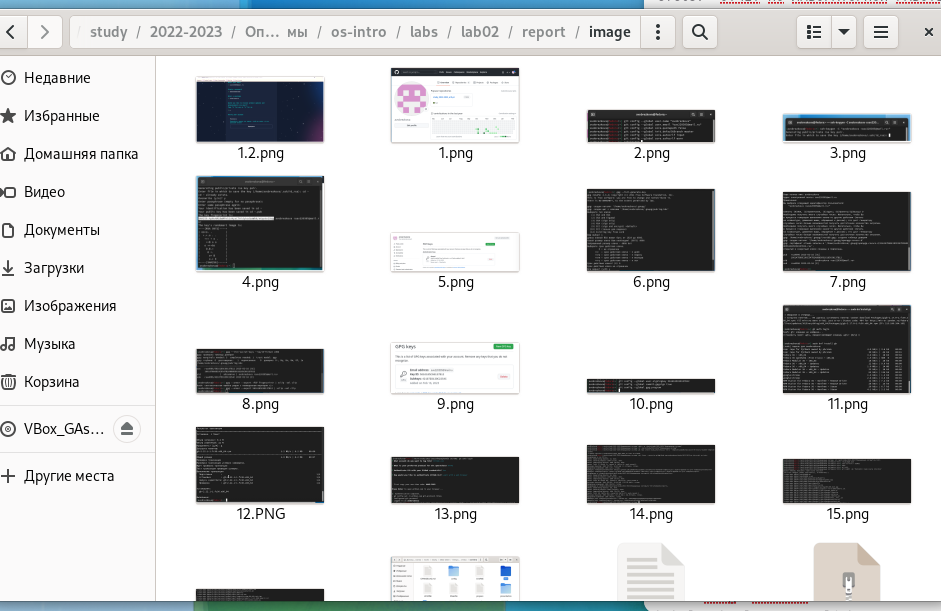{ #fig:001 width=70% }

2. Откралы файл Markdown, ввела название работы и дисциплины. (рис. [-@fig:002])

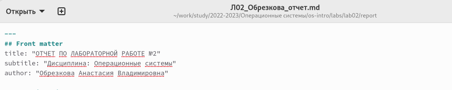{ #fig:002 width=70% }

3. Заполинала цель работы и задачи, поставленные для выполнения лабораторной работы. (рис. [-@fig:003])

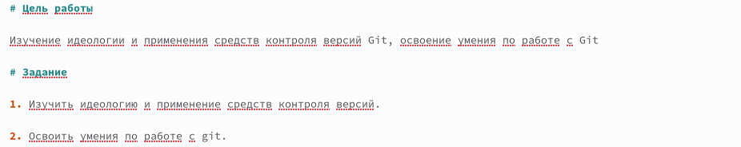{ #fig:003 width=70% }

4. Написала теоретическое введение. (рис. [-@fig:004])

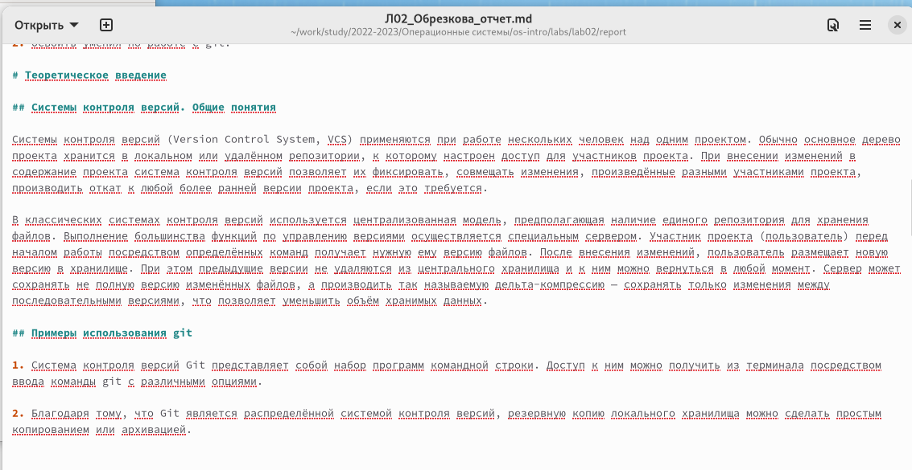{ #fig:004 width=70% }

5. Написала нужные заголовки (#) и подзаголовки (##). (рис. [-@fig:005])

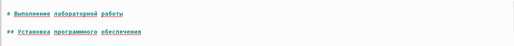{ #fig:005 width=70% }

6. Прописала действия, которые делала при выполнении работы. К каждому действию прикрепила скриншот выполнения с подписью. (рис. [-@fig:006])

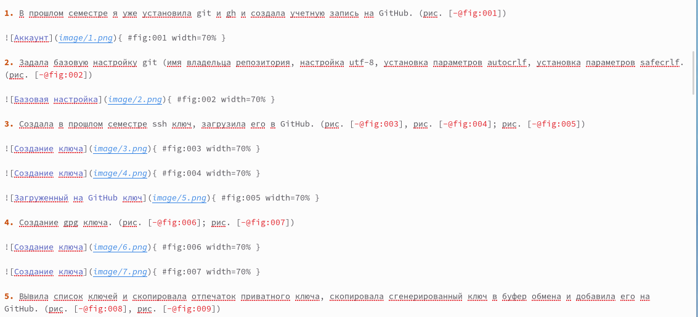{ #fig:006 width=70% }

7. Прикрепила ссылку на GitHub. (рис. [-@fig:007])

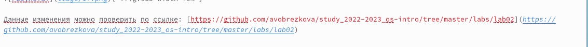{ #fig:007 width=70% }

8. Ответила на контрольные вопросы после лабораторной работы. (рис. [-@fig:008])

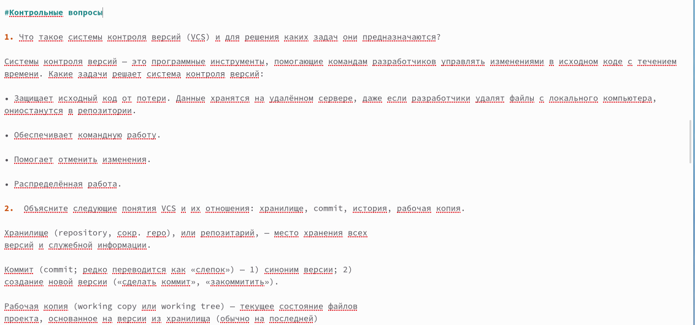{ #fig:008 width=70% }

9. Написала вывод и прикрепила список литературы. (рис. [-@fig:009])

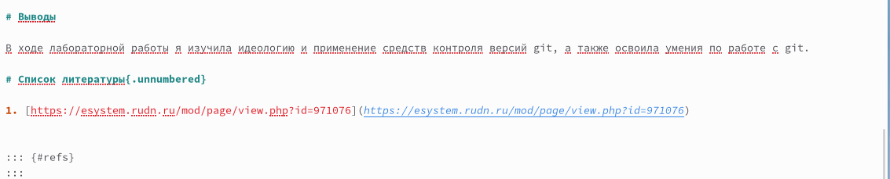{ #fig:009 width=70% }

9. С помощью команды make создала файлы docx и pdf. (рис. [-@fig:010])

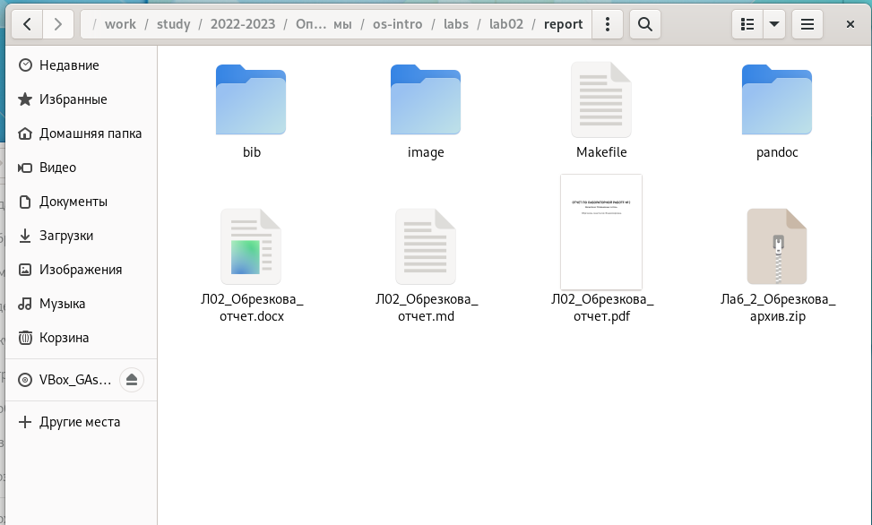{ #fig:010 width=70% }

9. Загрузила файлы на GitHub. (рис. [-@fig:011])

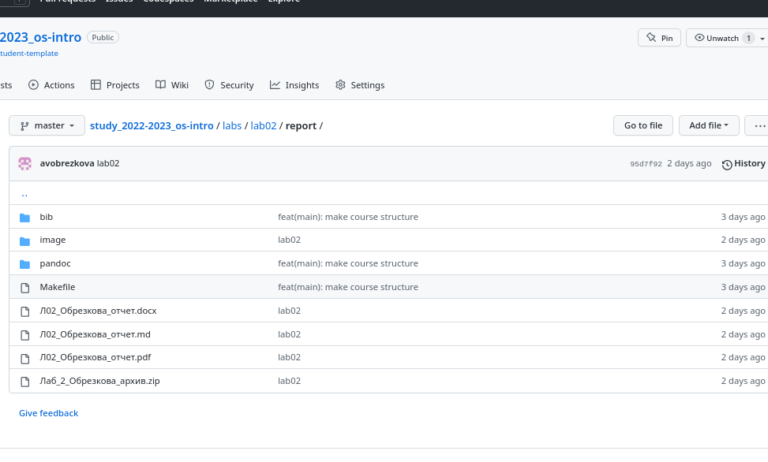{ #fig:011 width=70% }

Данные изменения можно проверить по ссылке: [https://github.com/avobrezkova/study_2022-2023_os-intro/tree/master/labs/lab02](https://github.com/avobrezkova/study_2022-2023_os-intro/tree/master/labs/lab02)

Ссылка на лабораторную работу №2: [https://github.com/avobrezkova/study_2022-2023_os-intro/tree/master/labs/lab02/report](https://github.com/avobrezkova/study_2022-2023_os-intro/tree/master/labs/lab02/report)

# Выводы

В ходе лабораторной работы я создала отчет по лабораторной работе №2 в формате Markdown и загрузилв его на GitHub.

# Список литературы{.unnumbered}

1. [https://esystem.rudn.ru/pluginfile.php/1976031/mod_resource/content/3/003-lab_markdown.pdf](https://esystem.rudn.ru/pluginfile.php/1976031/mod_resource/content/3/003-lab_markdown.pdf)

::: {#refs}
:::
