---
## Front matter
lang: ru-RU
title: Презентация по лабораторной работе №4
subtitle: Операционные системы
author:
  - Обрезкова Анастасия Владимировна
institute:
  - Российский университет дружбы народов, Москва, Россия
  - ФФМиЕН
date: 03 марта 2022

## i18n babel
babel-lang: russian
babel-otherlangs: english

## Formatting pdf
toc: false
toc-title: Содержание
slide_level: 2
aspectratio: 169
section-titles: true
theme: metropolis
header-includes:
 - \metroset{progressbar=frametitle,sectionpage=progressbar,numbering=fraction}
 - '\makeatletter'
 - '\beamer@ignorenonframefalse'
 - '\makeatother'
---

# Информация

## Докладчик

:::::::::::::: {.columns align=center}
::: {.column width="70%"}

  * Обрезкова Анастасия Владимировна
  * студентка направления "Математика и механика"
  * Российский университет дружбы народов
  * [1132226505@pfur.ru](1132226505@mail.ru)

:::
::: {.column width="30%"}

:::
::::::::::::::

# Вводная часть

## Цель работы

Приобретение практических навыков взаимодействия пользователя с системой посредством командной строки. 

## Объект и предмет исследования

- Командная строка

# Основная часть

## Полное имя домашнего каталога

- Для определения полного имени домашнего каталога мы используем команду *pwd*. 

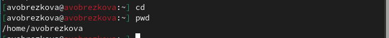{#fig:001 width=70%}

## Выполняем второй пункт лабораторной работы

- Выводим на экран содержимое каталога */tmp*. Для этого используем команду *ls*. 

- "ls" - выводится список каталогов и файлов, которые можно увидеть,"вручную" открыв каталог tmp.

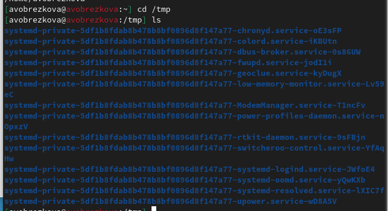{#fig:002 width=40%}

## Выполняем второй пункт лабораторной работы

- "ls -a" - к списку, описанному выше, добавляются скрытые каталоги и файлы 

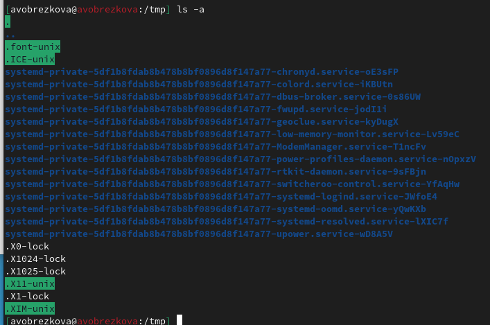{#fig:003 width=40%}

## Выполняем второй пункт лабораторной работы

- "ls -alF" - данна команда отображает список всех каталогов и файлов, в том числе и скрытых, с подробной информацией о них.

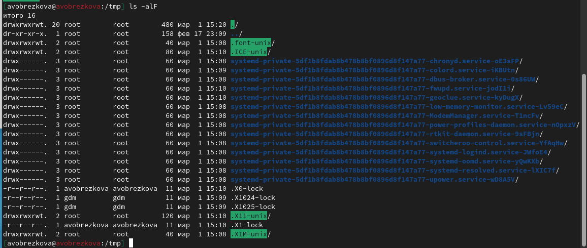{#fig:004 width=40%}

## Существование каталога corn

- Каталога corn не существует

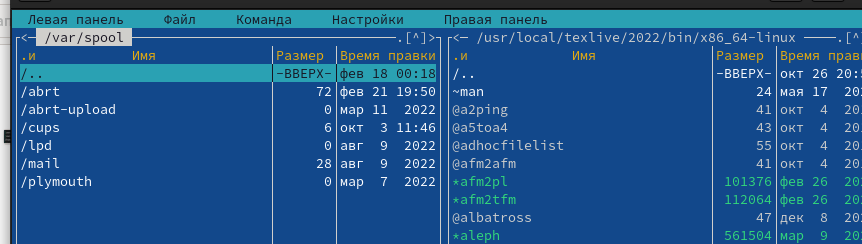{#fig:005 width=40%}

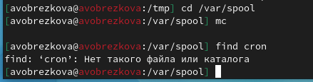{#fig:006 width=40%}

## Владелец каталогов

- Перешла в домашний каталог и используя команду *ls -la* учидела, что владельцем всех каталогом и файлов, кроме родительского каталога, является avobrezkova. 

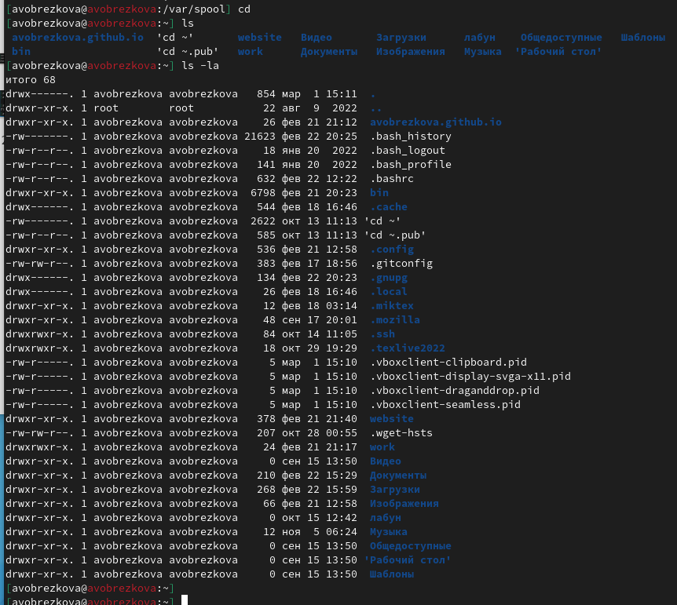{#fig:007 width=40%}

## Выполнение следующих действий

- В домашнем каталоге создала новый каталог *newdir*. Командой *ls* проверила наличие каталога.

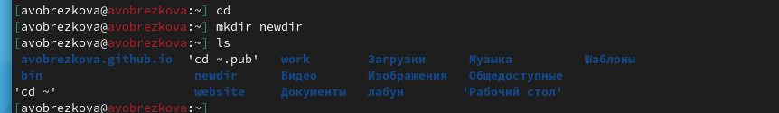{#fig:008 width=40%}

- Создала подкаталог *morefun*. Командой *ls* проверила выполнение действий. 

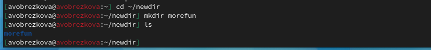{#fig:009 width=40%}

## Выполнение следующих действий

- Создала одной командой три новых каталога с именами *letter, memos, misk*, а затем удалила их одной командой *rmdir "название файлов"*. 

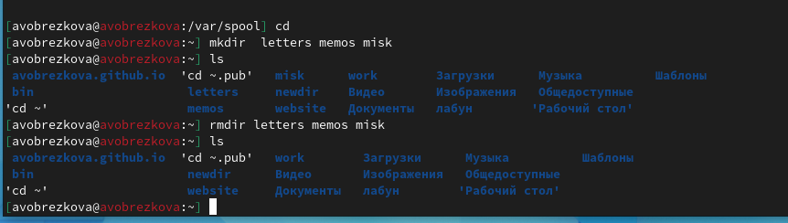{#fig:010 width=40%}

## Выполнение следующих действий

- Попроовала удалить каталог *newdir* командой *rm*, но получаем отказ. Тогда уадалила его с помощью команды *rm -r*. Командой *ls* проверяем выполнение.

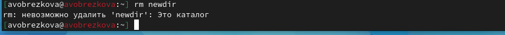{#fig:011 width=40%}

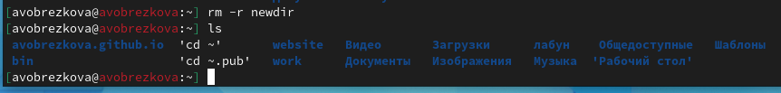{#fig:012 width=40%}

## Опция команды ls

- С помощью команды *man ls* определила опцию команды ls, которую необхожимо использовать, что посмотреть сожержимое не только указанного каталога, но и подкаталогов, входящих в него. 

{#fig:013 width=40%}

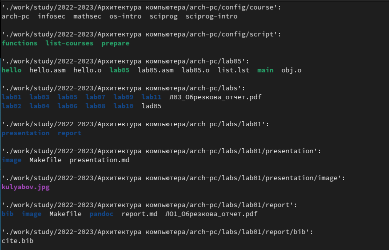{#fig:014 width=40%}

## Опции команд ls

- С помощью команды *man ls* определила опции команды ls, которые позволяют отсортировать по времени последнего изменения выводимый список содержимого каталога с развёрнутым описанием фалов. 

{#fig:015 width=40%}

{#fig:016 width=40%}

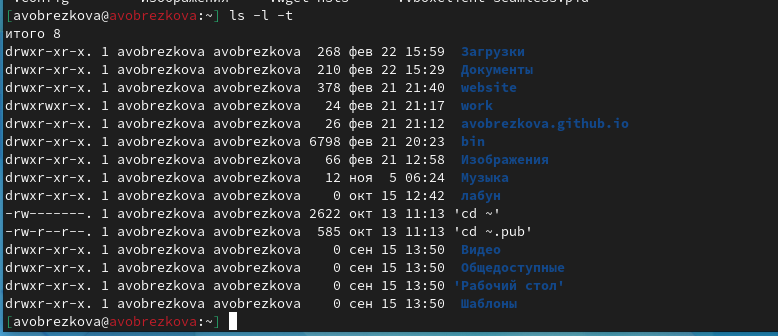{#fig:017 width=40%}

## Просмотр описания команд с помощью команды man

- Используем команду *man* для просмотра описания следующих команд: .

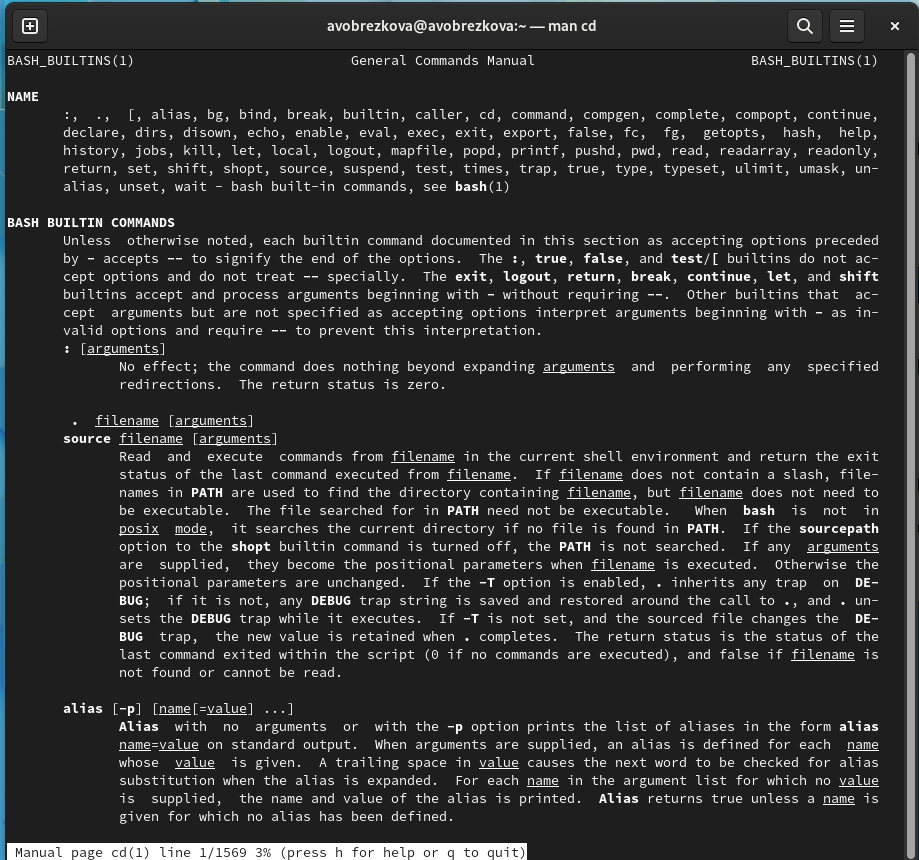{#fig:018 width=40%}

## Просмотр описания команд с помощью команды man

- cd, с помощью команды cd (change directory) можно перемещаться по дереву каталогов. Для этой команды необходим один параметр — целевой каталог. Можно использовать относительный путь (относительно текущего каталога) и абсолютный (относительно корня).

- pwd

-L, --logical - брать директорию из переменной окружения, даже если она содержит символические ссылки;

-P - отбрасывать все символические ссылки;

--help - отобразить справку по утилите;

--version - отобразить версию утилиты.

## Просмотр описания команд с помощью команды man

- mkdir

–mode=MODE устанавливает права доступа для создаваемой директории. Синтаксис MODE такой же как у команды chmod;

-p,–parents создать все директории, которые указаны внутри пути. Если
какая-либо директория существует, то предупреждение об этом не выводится;

-v, –verbose выводить сообщение о каждой создаваемой директории; 

-z установить контекст SELinux для создаваемой директории по умолчанию;

–context[=CTX] установить контекст SELinux для создаваемой директории в
значение CTX;

–help показать справку по команде mkdir;

–version показать версию утилиты mkdir

## Просмотр описания команд с помощью команды man

- rmdir 

–ignore-fail-on-non-empty игнорировать директории, которые содержат в себе файлы;

-p, –parents в этой опции каждый аргумент каталога обрабатывается как путь, из которого будут удалены все компоненты, если они
уже пусты, начиная с последнего компонента;

-v, –verboseотображение подробной информации для каждого обрабатываемого каталога; 

-–help показать справку по команде rmdir; 

–version показать версию утилиты rmdir

## Просмотр описания команд с помощью команды man

- rm

-f, –force игнорировать несуществующие файлы и аргументы.Никогда не выдавать запросы на подтверждение удаления;

-i выводить запрос на подтверждение удаления каждого файла; 

-I выдать один запрос на подтвержде-ние удаления всех файлов, если удаляется больше трех файлов или используется рекурсивное удаление. Опция применяется, как более «щадящая» версия опции

–one-file-system во время рекурсивного удаления пропускать директории, которые находятся на других файловых системах;

–no-preserve-root если в качестве директории для удаления задан корневой раздел /, то считать, что это обычная директория и начать вы-
полнять удаление; 

-r, -R, –recursive удаление директорий и их содержимого. Рекурсивное удаление; 

-d, –dir удалять пустые директории; 

-v, –verbose выводить информацию об удаляемых файлах;

–help показать справку по команде rm;

–version показать версию утилиты rm

## Команда history

- Вывела историю с помощью команды “history” и модифицировала пару из команд.

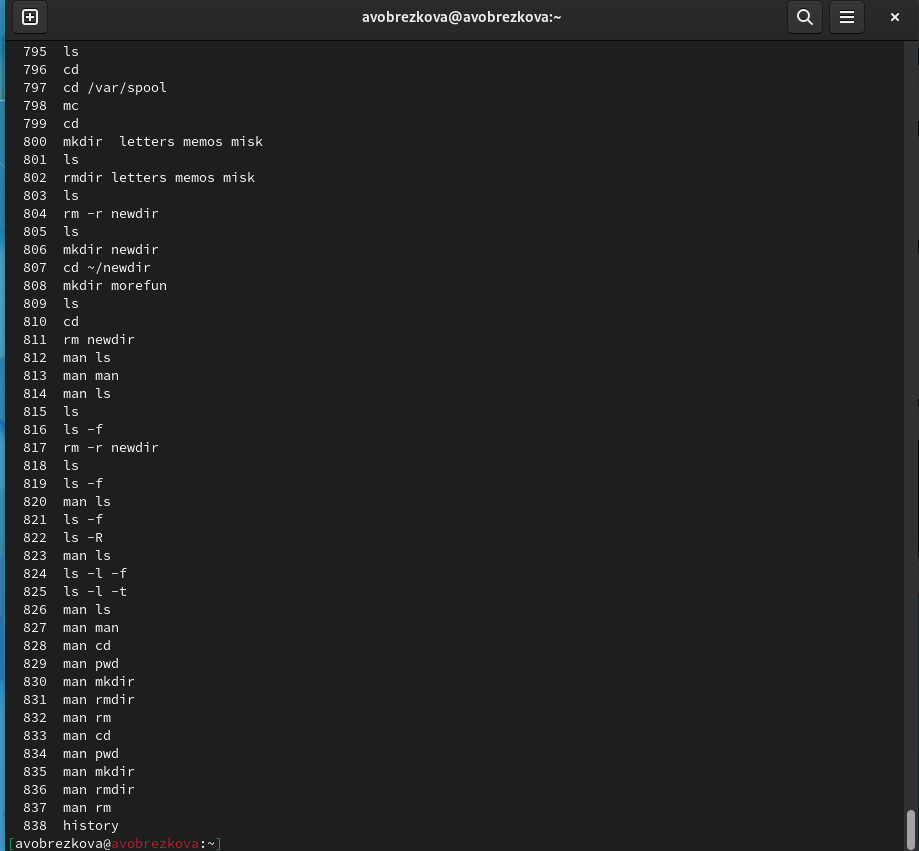{#fig:019 width=40%}

## Команда history

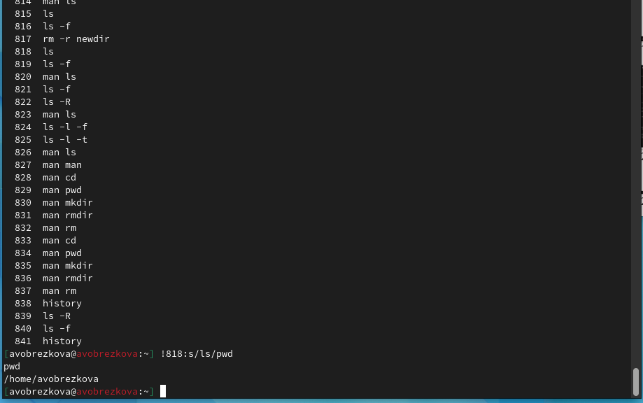{#fig:019 width=40%}

# Вывод

В ходе выполнения данной лабораторной работы я приобрела практические навыки по взаимодейсвтию с системой посредством командной строки. 

