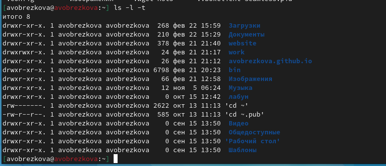
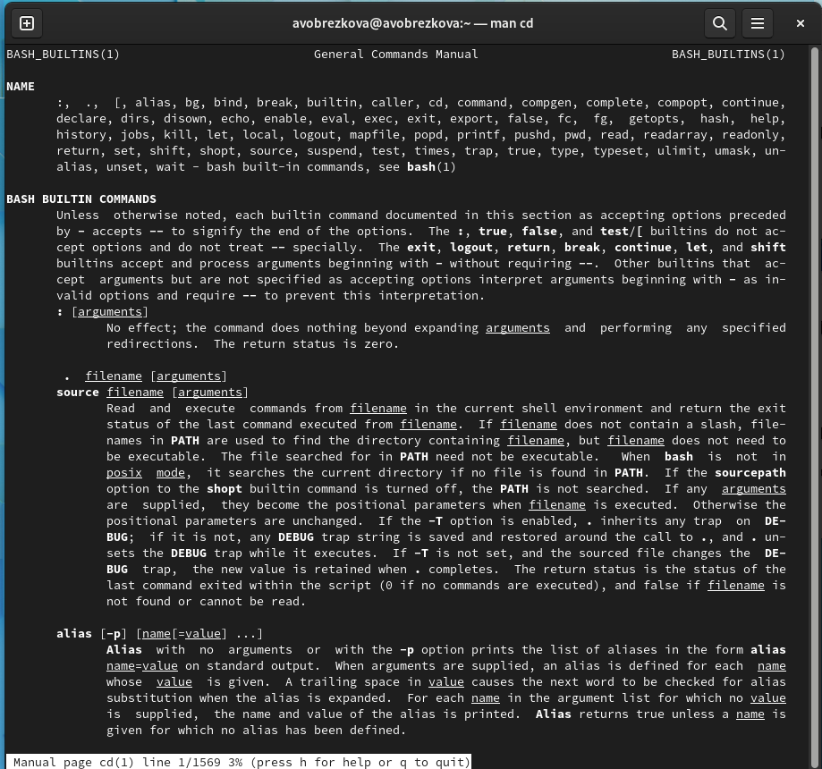
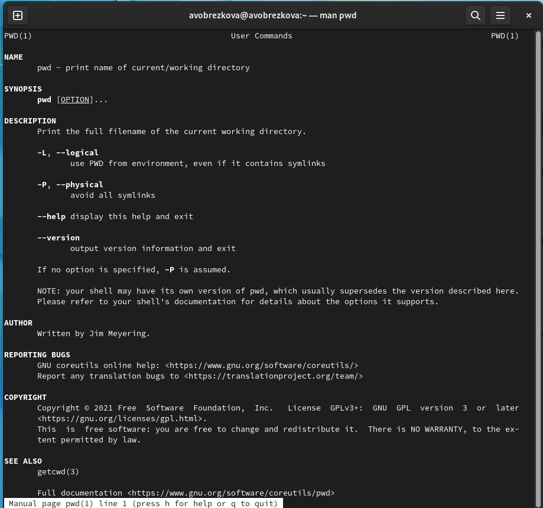
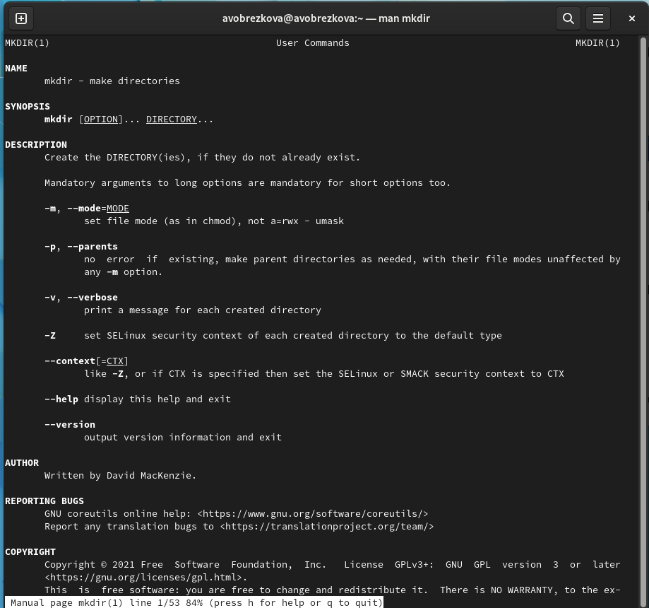
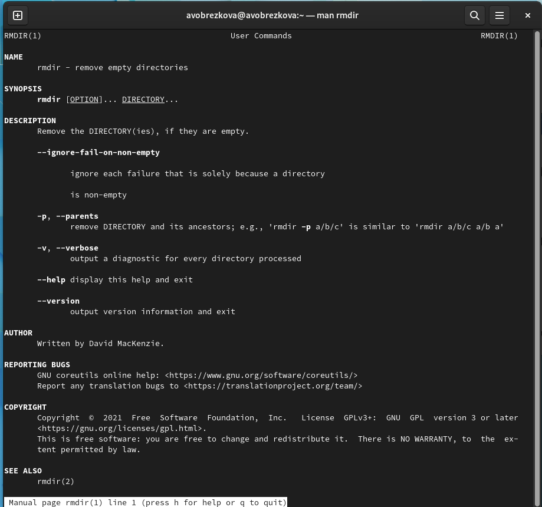
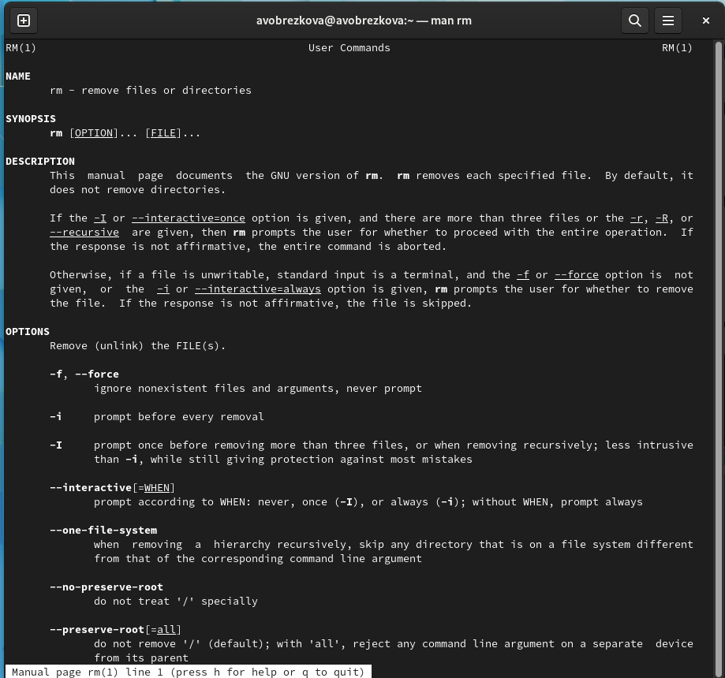
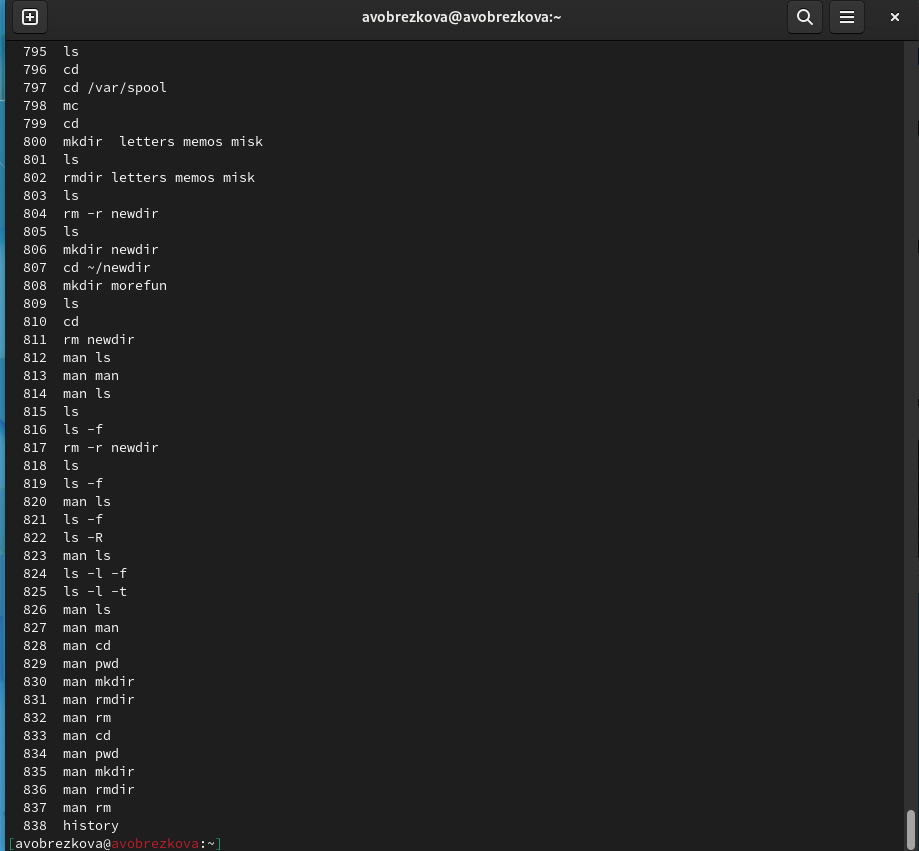
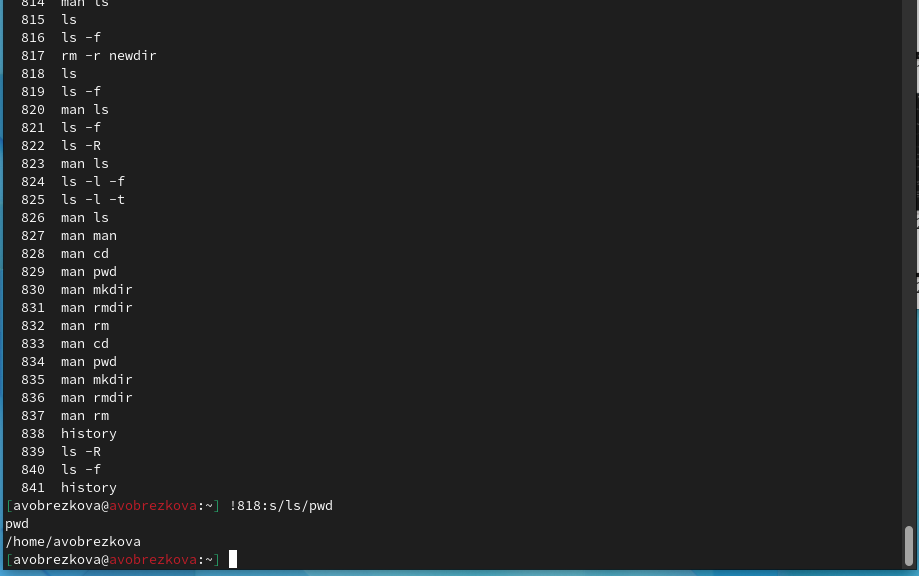

---
## Front matter
title: "Отчёт по лабораторной работе №4"
subtitle: "Операционные системы"
author: "Обрезкова Анастасия Владимировна"

## Generic otions
lang: ru-RU
toc-title: "Содержание"

## Bibliography
bibliography: bib/cite.bib
csl: pandoc/csl/gost-r-7-0-5-2008-numeric.csl

## Pdf output format
toc: true # Table of contents
toc-depth: 2
lof: true # List of figures
lot: true # List of tables
fontsize: 12pt
linestretch: 1.5
papersize: a4
documentclass: scrreprt
## I18n polyglossia
polyglossia-lang:
  name: russian
  options:
	- spelling=modern
	- babelshorthands=true
polyglossia-otherlangs:
  name: english
## I18n babel
babel-lang: russian
babel-otherlangs: english
## Fonts
mainfont: PT Serif
romanfont: PT Serif
sansfont: PT Sans
monofont: PT Mono
mainfontoptions: Ligatures=TeX
romanfontoptions: Ligatures=TeX
sansfontoptions: Ligatures=TeX,Scale=MatchLowercase
monofontoptions: Scale=MatchLowercase,Scale=0.9
## Biblatex
biblatex: true
biblio-style: "gost-numeric"
biblatexoptions:
  - parentracker=true
  - backend=biber
  - hyperref=auto
  - language=auto
  - autolang=other*
  - citestyle=gost-numeric
## Pandoc-crossref LaTeX customization
figureTitle: "Рис."
tableTitle: "Таблица"
listingTitle: "Листинг"
lofTitle: "Список иллюстраций"
lotTitle: "Список таблиц"
lolTitle: "Листинги"
## Misc options
indent: true
header-includes:
  - \usepackage{indentfirst}
  - \usepackage{float} # keep figures where there are in the text
  - \floatplacement{figure}{H} # keep figures where there are in the text
---

# Цель работы

Приобретение практических навыков взаимодействия пользователя с системой посредством командной строки. 

# Теоретическое введение

## Формат команды

Командой в операционной системе называется записанный по специальным правилам текст (возможно с аргументами), представляющий собой указание на выполнение какой-либо функций (или действий) в операционной системе. Обычно первым словом идёт имя команды, остальной текст — аргументы или опции, конкретизирующие действие.

Общий формат команд можно представить следующим образом:

<имя_команды><разделитель><аргументы>

## Команда man

Команда man используется для просмотра (оперативная помощь) в диалоговом режиме руководства (manual) по основным командам операционной системы типа Linux.

Формат команды:

man <команда>

## Команда pwd

Для определения абсолютного пути к текущему каталогу используется команда pwd (print working directory).

## Команда ls

Команда ls используется для просмотра содержимого каталога.

Формат команды:

ls [-опции] [путь]

## Команда mkdir

Команда mkdir используется для создания каталогов.

Формат команды:

mkdir имя_каталога1 [имя_каталога2...]

# Выполнение лабораторной работы

1. Определила полное имя моего домашнего каталога. (рис. [-@fig:001]).

{#fig:001 width=70%}

2. Выполнила второй пункт лабораторной работы.

2.1. Перешла в каталог */tmp*.

2.2. Вывела на экран содержимое каталога */tmp*. Для этого использовала команду *ls*. При этом изспользовала разные опции, а именно: 

- "ls" - выводится список каталогов и файлов, которые можно увидеть,"вручную" открыв каталог tmp. (рис. [-@fig:002])

{#fig:002 width=70%}

- "ls -a" - к списку, описанному выше, добавляются скрытые каталоги и файлы (рис. [-@fig:003])

{#fig:003 width=70%}

- "ls -alF" - данна команда отображает список всех каталогов и файлов, в том числе и скрытых, с подробной информацией о них.(рис. [-@fig:004])

{#fig:004 width=70%}

2.3.Чтобы определить есть ли в каталоге */var/spool* подкаталог с именем *corn*, перешла в указанный катаолог и просмотрела его содержимое. Каталог не существует (лабораторная работы выполняется на собственном компьютере). (рис. [-@fig:005]; рис. [-@fig:006])

{#fig:005 width=70%}

{#fig:006 width=70%}

2.4. Затем перешла в домашний каталог и используя команду *ls -la* увидела, что владельцем всех каталогом и файлов, кроме родительского каталога, является avobrezkova. (рис. [-@fig:007])

{#fig:007 width=70%}

3. Выполняем следующие действия

3.1. В домашнем каталоге создала новый каталог *newdir*. Это можно сделать с помощью команды *mkdir*. Командой *ls* проверила наличие каталога. (рис. [-@fig:008])

{#fig:008 width=70%}

3.2. Затем создала подкаталог. Для этого перешла в каталог и создаём новый *morefun*. Командой *ls* проверила выполнение действий. (рис. [-@fig:009])

{#fig:009 width=70%}

3.3. В домашнем каталоге создала одной командой три новых каталога с именами *letter, memos, misk*, а затем удалила их одной командой *rmdir "название файлов"*. (рис. [-@fig:010])

{#fig:010 width=70%}

3.4-3.5. Попробовала удалить каталог *newdir* командой *rm*, но получила отказ, так как в нём есть подкаталог. Тогда уадалила его с помощью команды *rm -r newdir/morefun*. Командой *ls* проверяем выполнение. Был удалён подкаталог. (рис. [-@fig:011]; рис. [-@fig:012])

{#fig:011 width=70%}

{#fig:012 width=70%}

4. Используя комнаду *man ls* определила опцию команды ls, которую необходимо использовать, чтобы посмотреть сожержимое не только указанного каталога, но и подкаталогов, входящих в него. (рис. [-@fig:013]), (рис. [-@fig:014]).

{#fig:013 width=70%}

{#fig:014 width=70%}

5. Используя тоже руководство, которые мы открыли с помощью *man ls*, я увидела опции команды, которые позволяют отсортировать по времени последнего изменения выводимый список содержимого каталога с развёрнутым описанием фалов. (рис. [-@fig:015]; рис. [-@fig:016]; рис. [-@fig:017]).

{#fig:015 width=70%}

{#fig:016 width=70%}

{#fig:017 width=70%}

6. Использовала команду *man* для просмотра описания следующих команд. (рис. [-@fig:018]; рис. [-@fig:019]; рис. [-@fig:020]; рис. [-@fig:021]; рис. [-@fig:022]).

Команда cd используется для перемещения по файловой системе операционной системы типа Linux.

{#fig:018 width=50%}

Для определения абсолютного пути к текущему каталогу используется команда pwd (print working directory).

{#fig:019 width=50%}

Команда mkdir используется для создания каталогов.

{#fig:020 width=50%}

Удалить пустые каталоги можно с помощью команды rmdir.

{#fig:021 width=50%}

Команда rm используется для удаления файлов и/или каталогов.

{#fig:022 width=50%}

7. Вывела историю с помощью команды “history” и модифицировала несколько команд.(рис. [-@fig:023]; рис. [-@fig:024]; рис. [-@fig:025])

{#fig:023 width=70%}

{#fig:024 width=70%}

{#fig:025 width=70%}

Данные изменения можно проверить по ссылке: [https://github.com/avobrezkova/study_2022-2023_os-intro/tree/master/labs/lab04](https://github.com/avobrezkova/study_2022-2023_os-intro/tree/master/labs/lab04)

# Выводы

В ходе выполнения данной лабораторной работы я приобрела практические навыки по взаимодейсвтию с системой посредством командной строки. 

# Контрольные вопросы 

1. Что такое командная строка?

Команднаястрока–специальная программа, позволяющая управлять операционной системой при помощи текстовых команд, вводимых в окне приложения.

2. При помощи какой команды можно определить абсолютный путь текущего каталога?

Для определения абсолютного пути к текущему каталогу используется команда pwd (print working directory).

3. При помощи какой команды и каких опций можно определить только тип файлов и их имена в текущем каталоге?

Команда «ls-F» (или «ls-aF», тогда появятся еще скрытые файлы) выведет имена файлов в текущем каталоге и их типы. Тип каталога обозначается /, тип исполняемого файла обозначается *, тип ссылки обозначается @.

4. Каким образом отобразить информацию о скрытых файлах?

Имена скрытых файлов начинаются с точки. Эти файлы в операционной системе скрыты от просмотра и обычно используются для настройки рабочей среды. Для того, чтобы отобразить имена скрытых файлов, необходимо использовать команду «ls –a».

5. При помощи каких команд можно удалить файл и каталог? Можно ли это сделать одной и той же командой?

Команда rm используется для удаления файлов и/или каталогов. Команда rm-iвыдает запрос подтверждения наудаление файла. Команда rm-rнеобходима, чтобы удалить каталог, содержащий файлы. Без указания этой опции команда не будет выполняться. Если каталог пуст, то можно воспользоваться командой rmdir. Если удаляемый каталог содержит файлы, то команда не будетвыполнена –нужно использовать «rm -r имя_каталога».Таким образом, каталог, не содержащий файлов, можно удалить и командой rm, и командой rmdir. Файл командой rmdirудалить нельзя.

6. Каким образом можно вывести информацию о последних выполненных пользователем командах? работы?

Чтобы определить, какие команды выполнил пользователь в сеансе работы, необходимо воспользоваться командой «history».

7. Как воспользоваться историей команд для их модифицированного выполнения?

Чтобы исправить илизапустить на выполнение команду, которую пользователь уже использовал в сеансе работы, необходимо: в первом случае:воспользоваться конструкцией !<номер_команды>:s/<что_меняем>/<на_что_меняем>, во втором случае: !<номер_команды>.

8. Приведите примеры запуска нескольких команд в одной строке.

Чтобы записать в одной строке несколько команд, необходимо между ними поставить ; . Например, «cd /tmp; ls».

9. Дайте определение и приведите примера символов экранирования.

Символ обратного слэша \ позволяет использовать управляющие символы (".", "/", "$", "*", "[", "]", "^", "&") без их интерпретации командной оболочкой; процедура добавления данного символа перед управляющими символами называетсяэкранированием символов.Например, команда «lsnewdir/morefun» отобразит содержимое каталога newdir/morefun.

10. Охарактеризуйте вывод информации на экран после выполнения команды ls с опцией l.

Команда «ls -l» отображает список каталогов и файлов с подробной информацией о них(тип файла, право доступа, число ссылок, владелец, размер, дата последней ревизии, имя файла или каталога).

11. Что такое относительный путь к файлу? Приведите примеры использования относительного и абсолютного пути при выполнении какой-либо команды.

Полный, абсолютный путь от корня файловой системы –этот путь начинается от корня "/" и описывает весь путь к файлуили каталогу; Относительный путь–это путь к файлу относительно текущего каталога(каталога, где находится пользователь).Например, «cd/newdir/morefun»–абсолютный путь, «cdnewdir»–относительный путь.

12. Как получить информацию об интересующей вас команде?

Чтобы получить необходимую информацию о команде, необходимо воспользоваться конструкцией man[имя_команды], либо использовать опцию help, которая предусмотрена для некоторых команд.

13. Какая клавиша или комбинация клавиш служит для автоматического дополнения вводимых команд?

Для автоматического дополнения вводимых команд служит клавиша Tab.

# Список литературы{.unnumbered}

1. [file:///home/avobrezkova/%D0%97%D0%B0%D0%B3%D1%80%D1%83%D0%B7%D0%BA%D0%B8/004-lab_shell.pdf](file:///home/avobrezkova/%D0%97%D0%B0%D0%B3%D1%80%D1%83%D0%B7%D0%BA%D0%B8/004-lab_shell.pdf)

::: {#refs}
:::
