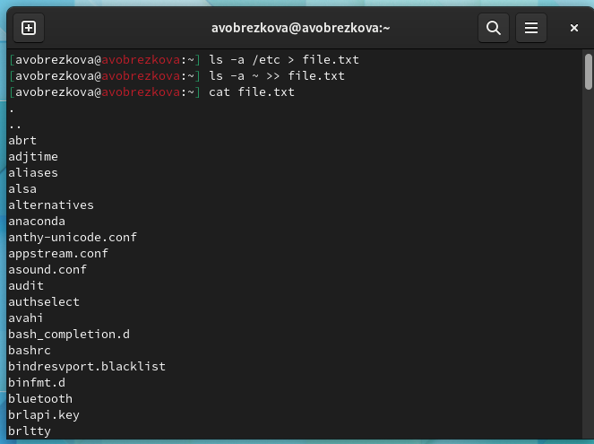

---
## Front matter
lang: ru-RU
title: Лабораторной работы №6
subtitle: Дисциплина "Операционные системы"
author:
  - Обрезкова А.В.
institute:
  - Российский университет дружбы народов, Москва, Россия
  - ФФМиЕН
date: 18 марта 2023

## i18n babel
babel-lang: russian
babel-otherlangs: english

## Formatting pdf
toc: false
toc-title: Содержание
slide_level: 2
aspectratio: 169
section-titles: true
theme: metropolis
header-includes:
 - \metroset{progressbar=frametitle,sectionpage=progressbar,numbering=fraction}
 - '\makeatletter'
 - '\beamer@ignorenonframefalse'
 - '\makeatother'
---

# Информация

## Докладчик

:::::::::::::: {.columns align=center}
::: {.column width="70%"}

  * Обрезкова Анастасия Владимировна
  * студентка направления "Математика и механика"
  * Российский университет дружбы народов
  * [1132226505@pfur.ru](1132226505@mail.ru)

:::
::: {.column width="30%"}

:::
::::::::::::::

# Вводная часть

## Цель работы

Ознакомиться с инструментами поиска файлов и фильтрации текстовых данных. Приобретение практических навыков: по управлению процессами (и заданиями), по проверке использования диска и обслуживанию файловых систем.

# Основная часть

## Выполнение лабораторной работы

- Записала в файл file.txt названия файлов, содержащихся в каталоге /etc и в домашнем каталоге

## 

- Вывела имена всех файлов из file.txt, имеющих расширение .conf, после чего записала их в новый текстовой файл conf.txt.

## 

- Определила, какие файлы в моем домашнем каталоге имеют имена, начинавшиеся с символа c.

## 

- Вывела на экран (по странично) имена файлов из каталога /etc, начинающиеся с символа h.

##

- Запустила в фоновом режиме процесс, который будет записывать в файл ~/logfile файлы, имена которых начинаются с log

## 

- Удалила файл ~/logfile

## 

- Запустила из консоли в фоновом режиме редактор gedit. после ввода команды gedit & появляется окно редактора

## 

- Определила идентификатор процесса gedit, используя команду ps, конвейер и фильтр grep

## 

- Прочитала справку (man) команды kill, после чего использовала её для завершения процесса gedit

## 

## Команды df и du

- df - утилита, показывающая список всех файловых систем по именам устройств, сообщает их размер, занятое и свободное пространство и точки монтирования

## Команды df и du

- du - утилита, предназначенная для вывода информации об объеме дискового пространства, занятого файлами и директориями. Она принимает путь к элементу файловой системы и выводит информацию о количестве байт дискового пространства или блоков диска, задействованных для его хранения.

## Команды df и du

## Команды df и du

## Команда find

## Команда find

- Вывела имена всех директорий, имеющихся в моем домашнем каталоге

# Заключение

## Вывод

В ходе выполнения данной лабораторной работы я ознакомилась с инструментами поиска файлов и фильтрации текстовых данных, а также приобрела практические навыки по управлению процессами, по проверке использования диска и обслуживанию файловых систем.

