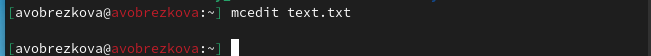

---
## Front matter
lang: ru-RU
title: Лабораторной работе №7
subtitle: Операционные системы
author:
  - Обрезкова Анастасия Владимировна
institute:
  - Российский университет дружбы народов, Москва, Россия
  - ФФМиЕН
date: 25 марта 2023

## i18n babel
babel-lang: russian
babel-otherlangs: english

## Formatting pdf
toc: false
toc-title: Содержание
slide_level: 2
aspectratio: 169
section-titles: true
theme: metropolis
header-includes:
 - \metroset{progressbar=frametitle,sectionpage=progressbar,numbering=fraction}
 - '\makeatletter'
 - '\beamer@ignorenonframefalse'
 - '\makeatother'
---

# Информация

## Докладчик

:::::::::::::: {.columns align=center}
::: {.column width="70%"}

  * Обрезкова Анастасия Владимировна
  * студентка направления "Математика и механика"
  * Российский университет дружбы народов
  * [1132226505@pfur.ru](1132226505@mail.ru)

:::
::: {.column width="30%"}

:::
::::::::::::::
# Вводная часть

## Цель работы

Освоение основных возможностей командной оболочки Midnight Commander. Приобретение навыков практической работы по просмотру каталогов и файлов; манипуляций с ними

# Основная часть

## Выполнение лабораторной работы

Задание по *mc*.

Изучаем информацию о mc, вызвав в командной строке man mc

##

Dерхнее меню содержит “Левая панель”, “Файл”, “Команда”, “Настройки”, “Правая панель”. Также, начав клавиши F1 и F2 мы можем открыть “Помощь” или “Меню пользователя”.

##

##

Выделение и отмена выделения файлов. Для этого используем “shift”+стрелку вниз.

## 

Копирование и перемещение файлов. Для копирования используем клафишу “F5”, а для перемещения “F6”

##

##

После этого выполним команду для получения информации о размерах и правах доступа на файлы и/или каталоги. Это делаем таким путём: “Левая панель”-“Информация”.

##

## Выполним основные команды меню левой панели

##

"Список файлов” отображает размер файла и время его правки.

##

Быстрый просмотр” необходим для просмотра сожержания файлов, а пункт “Информация” отображает подробные данные для о файле

##

Пункт “Дерево” необходим для просмотра дерева каталога.

##

“Формат списка” 

- “Укороченный” отображает только имя файла или каталога.

- “Расширенный” отображает подробную информацию о файлах.

- ”Определённый пользователем” даёт возможность самостоятельно изменять степень подробнотио файле. 

- “Стандартный” ставится по умолчанию. 

## 

##

Пункт “Фильтр” необходим для того, чтобы просмотреть название файлов или каталогов, которые подходят под указанную маску.

“Порядок сортировки” необходим для сортировки файлов ил каталогов по конкретному критерию.

##

С помощью фозможностей подменю “Файл” выполним следующие действия. 

##

Для просмотра содержимого файла выберем пункт “Просмотр файла”. 

##

Для редактирования содержимого текстового файла перейдём в пункт “Правка” и изменим на “Hello”

##

Для создания каталога переходим в пункт “Создание каталога”

##

Копирование файлов в созданный каталог происходит с помощью выбора пункта “Копирование”. Выделим несколько файлов и пернесём их в каталог.

## С помощью средств подменю “Команда” осуществим следующие действия

Поиск в файловой системе файла с заданными условия

## 

##

Затем для выбора и повторения одной из предыдущих комнад перейдём в “История командной строки”-“История” внизу экрана, но это сноска пустая, т.к. не была использована командная строка.

##

Для перехода в домашний каталог переходим в пункт “Дерево каталогов” и выбираем необходимый каталог. 

##

Для анализа файла меню и файла расширение переходим в пункт “Редактировать файл расширений

## Вызовем подменю “Найстройки”

“Конфигурация” позволяет скорректировать найстройки работы с панелями. 

“Внешний вид” и “Настройка панелей” помогают определить элементы, отображаемые при вызове mc. 

Пункт “Подтверждение” помогаем установить или убрать вывод окна с хапросом подтверждения действий при операциях удаления и перезаписи файлов. 

Пунк “Оформление” даёт возможность менять цветовую гамму визуальной оболочки.

Пункт “Сохранить настройки” сохраняеn изменения

## Задание по встроенному редактору mc

Создаём текстовый файл “text.txt”, командой “ls” проверяем выполнение действий. 

Открываем этот файл с помощью встроенного mc редактора с помощью команды “mcedit text.txt”.

##

Вставим любой текстиз интернета и сделаем с ним следующие изменения.

##

Удалим некую строчку стихотворения с помощью команды “F8”.

##

Выделим фрагмент текста с помощью “F3” и скопируем его на новую строку с помощью клавиши”F5”. 

##

Сохраним файл с помощью клавиши “F2”.И отменим последнее действие с помощью клавиш “ctrl+u”.

##

Для перехода в конец файла используем сочетание клавиш “ctrl+end”, и напишем автора стихотворения.

##

Для перехода в начало испольузем “ctrl+home” и напишем заголовок. 

Сохраним и выйдем в konsole.

##

Откроем файл с исходным текстом на некотором языке прогроммирования. Введём команду “find / -name *.java”

##

Используя меню редактора “Команда” - ” Отключить панели” мы можем включить/выключить подсветку строки.

# Выводы

В процессе выполнения лабораторной работы я освоила основные возможности командной оболочки Midnight Commander. Приобрила навыки практической работы по просмотру каталогов и файлов; манипуляций с ними

