---
## Front matter
title: "Лабораторная работа №?"
subtitle: "Операционные системы"
author: "Обрезкова Анастасия Владимировна"

## Generic otions
lang: ru-RU
toc-title: "Содержание"

## Bibliography
bibliography: bib/cite.bib
csl: pandoc/csl/gost-r-7-0-5-2008-numeric.csl

## Pdf output format
toc: true # Table of contents
toc-depth: 2
lof: true # List of figures
lot: true # List of tables
fontsize: 12pt
linestretch: 1.5
papersize: a4
documentclass: scrreprt
## I18n polyglossia
polyglossia-lang:
  name: russian
  options:
	- spelling=modern
	- babelshorthands=true
polyglossia-otherlangs:
  name: english
## I18n babel
babel-lang: russian
babel-otherlangs: english
## Fonts
mainfont: PT Serif
romanfont: PT Serif
sansfont: PT Sans
monofont: PT Mono
mainfontoptions: Ligatures=TeX
romanfontoptions: Ligatures=TeX
sansfontoptions: Ligatures=TeX,Scale=MatchLowercase
monofontoptions: Scale=MatchLowercase,Scale=0.9
## Biblatex
biblatex: true
biblio-style: "gost-numeric"
biblatexoptions:
  - parentracker=true
  - backend=biber
  - hyperref=auto
  - language=auto
  - autolang=other*
  - citestyle=gost-numeric
## Pandoc-crossref LaTeX customization
figureTitle: "Рис."
tableTitle: "Таблица"
listingTitle: "Листинг"
lofTitle: "Список иллюстраций"
lotTitle: "Список таблиц"
lolTitle: "Листинги"
## Misc options
indent: true
header-includes:
  - \usepackage{indentfirst}
  - \usepackage{float} # keep figures where there are in the text
  - \floatplacement{figure}{H} # keep figures where there are in the text
---

# Цель работы

Освоение основных возможностей командной оболочки Midnight Commander. Приобретение навыков практической работы по просмотру каталогов и файлов, манипуляций с ними. 

# Выполнение лабораторной работы

## Задание по mc

1. Изучила информацию о mc, вызвав в командной строке man mc.(рис. [-@fig:001]).

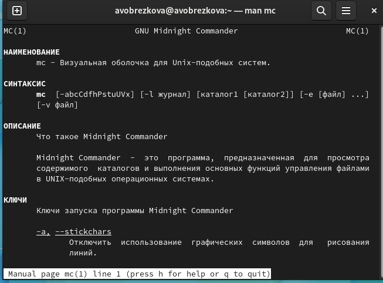{#fig:001 width=70%}

2. Запустила из командной строки mc и изучила его структуру и меню. Видим, что верхнее меню содержит “Левая панель”, “Файл”, “Команда”, “Настройки”, “Правая панель”. Нажав клавиши F1 и F2 мы можем открыть “Помощь” или “Меню пользователя”.(рис. [-@fig:002]),(рис. [-@fig:003]),(рис. [-@fig:004]).

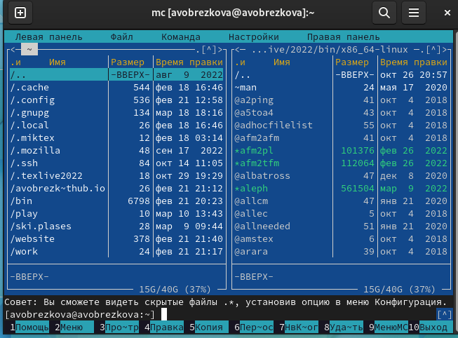{#fig:002 width=70%}

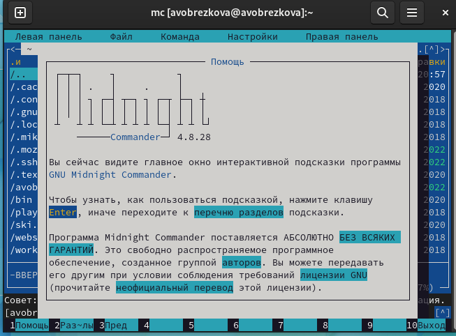{#fig:003 width=70%}

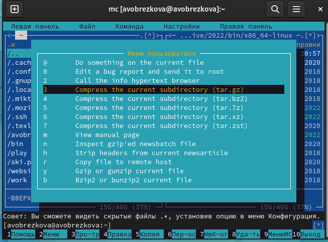{#fig:004 width=70%}

3. Выполнила несколько операций в mc, используя управляющие клавиши. 

Выделение и отмена выделения файлов. Для этого использовала “shift” + стрелку вниз.(рис. [-@fig:005]).

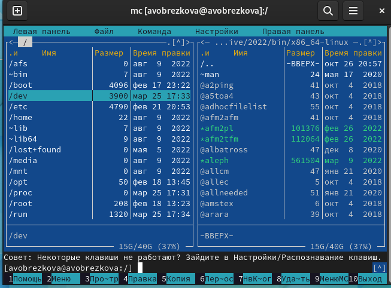{#fig:005 width=70%}

Копирование и перемещение файлов. Для копирования использовала клафишу “F5”, а для перемещения “F6”.(рис. [-@fig:006]), (рис. [-@fig:007]).

{#fig:006 width=70%}

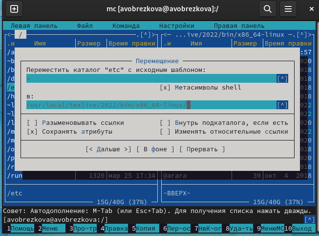{#fig:007 width=70%}

После этого выполнила команду для получения информации о размерах и правах доступа на файлы и/или каталоги. Это сделала следующим путём: “Левая панель”-“Информация”.(рис. [-@fig:008]),(рис. [-@fig:009]).

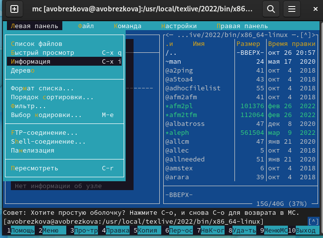{#fig:008 width=70%}

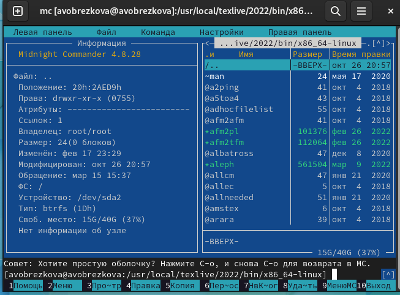{#fig:009 width=70%}

4. Выполнила основные команды меню левой панели.(рис. [-@fig:010])

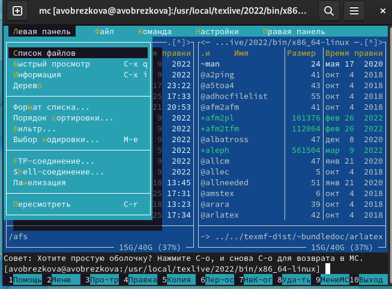{#fig:010 width=70%}

"Список файлов” отображает размер файла и время его правки.(рис. [-@fig:011])

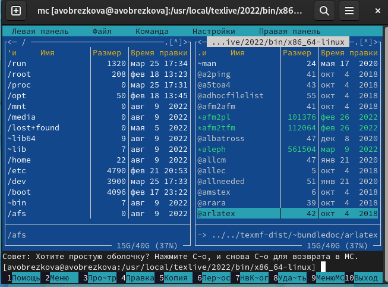{#fig:011 width=70%}

"Быстрый просмотр” необходим для просмотра сожержания файлов, а пункт “Информация” отображает подробные данные для о файле.(рис. [-@fig:012])

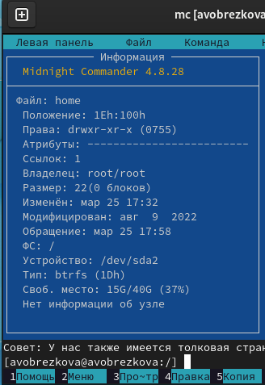{#fig:012 width=70%}

Пункт “Дерево” необходим для просмотра дерева каталога.(рис. [-@fig:013])

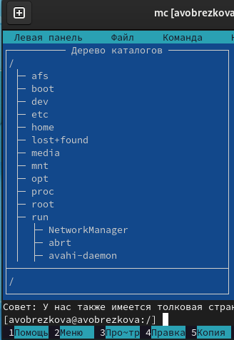{#fig:013 width=70%}

“Формат списка” (рис. [-@fig:014])

- “Укороченный” отображает только имя файла или каталога.

- “Расширенный” отображает подробную информацию о файлах.

- ”Определённый пользователем” даёт возможность самостоятельно изменять степень подробнотио файле. 

- “Стандартный” ставится по умолчанию. 

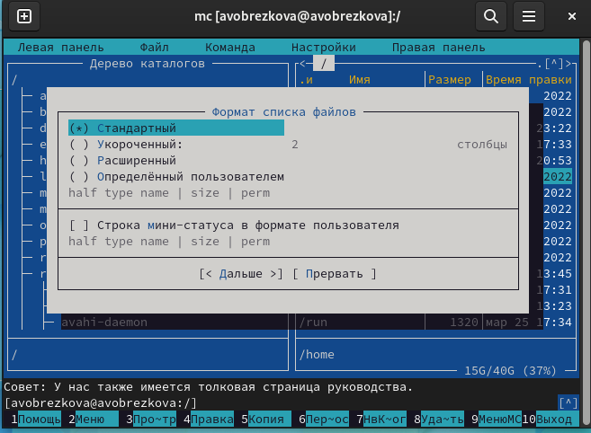{#fig:014 width=70%}

Пункт “Фильтр” необходим для того, чтобы просмотреть название файлов или каталогов, которые подходят под указанную маску. (рис. [-@fig:015])

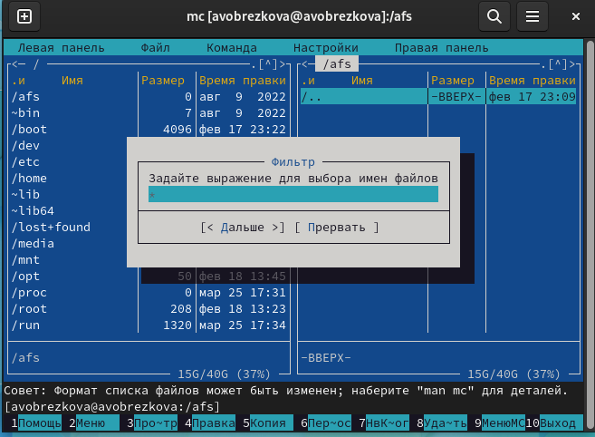{#fig:015 width=70%}

“Порядок сортировки” необходим для сортировки файлов ил каталогов по конкретному критерию. (рис. [-@fig:016])

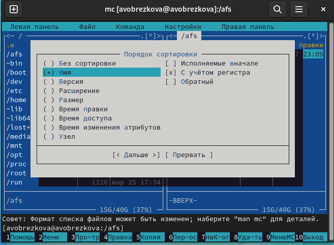{#fig:016 width=70%}

5. С помощью фозможностей подменю “Файл” выполнила следующие действия. (рис. [-@fig:017])

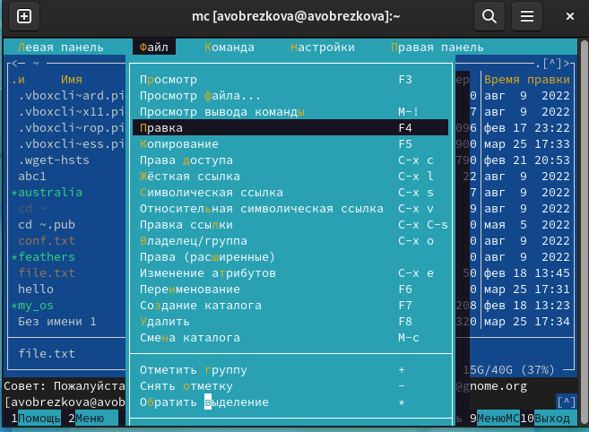{#fig:017 width=70%}

Для просмотра содержимого файла выберем пункт “Просмотр файла”, просмотрела отчет по лабораторной работе №3. (рис. [-@fig:018])

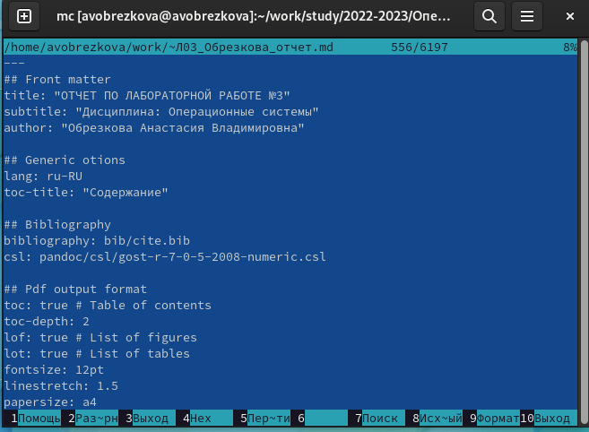{#fig:018 width=70%}

Для редактирования содержимого текстового файла перейдём в пункт “Правка” и напишем слово “Hello”. (рис. [-@fig:019])

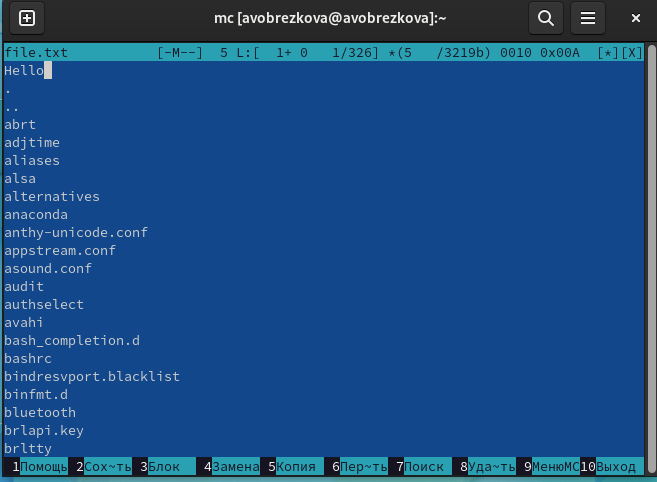{#fig:019 width=70%}

Для создания каталога переходим в пункт “Создание каталога”. Я создам каталог “anastasia”. (рис. [-@fig:020])

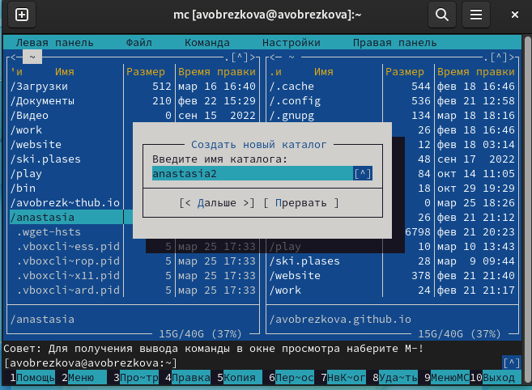{#fig:020 width=70%}

Копирование файлов в созданный каталог происходит с помощью выбора пункта “Копирование”. Выделила несколько файлов и перенесла их в каталог.(рис. [-@fig:021])

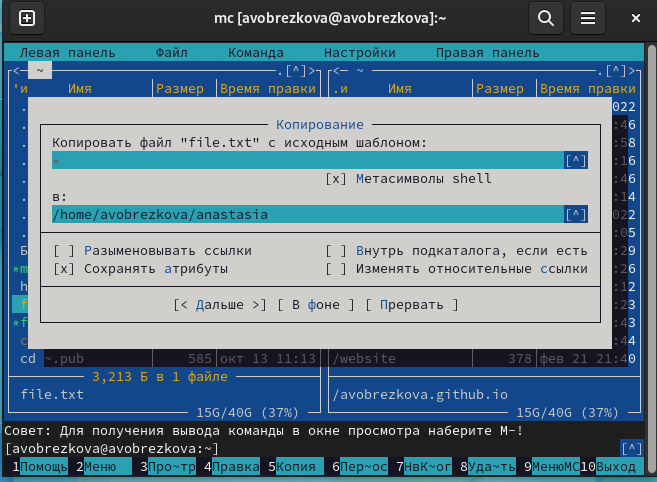{#fig:021 width=70%}

6. С помощью средств подменю “Команда” осуществила следующие действия: 

Поиск в файловой системе файла с заданными условия. Задаим условия “От каталога" - /, ”Шаблон имени” - *.сpp, “Содержимое” - main. (рис. [-@fig:022]), (рис. [-@fig:023])

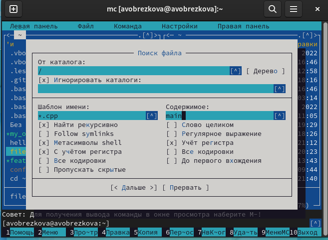{#fig:022 width=70%}

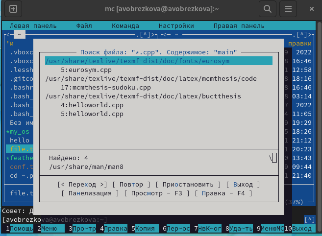{#fig:023 width=70%}

Затем для выбора и повторения одной из предыдущих комнад перешла в “История командной строки” - “История” (внизу экрана), но это сноска пустая, т.к. не была использована командная строка. (рис. [-@fig:024])

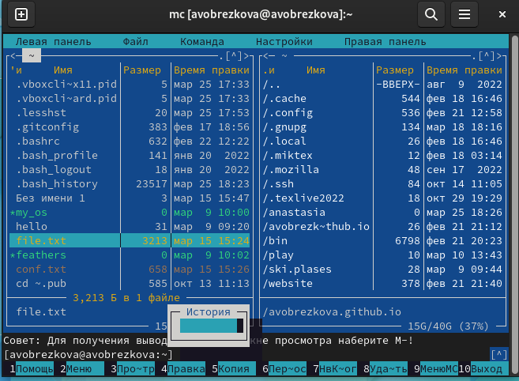{#fig:024 width=70%}

Для перехода в домашний каталог перешла в пункт “Дерево каталогов” и выбрала необходимый каталог. (рис. [-@fig:025])

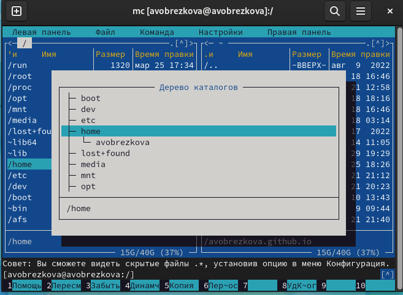{#fig:025 width=70%}

Для анализа файла меню и файла расширение перешла в пункт “Редактировать файл расширений".(рис. [-@fig:026])

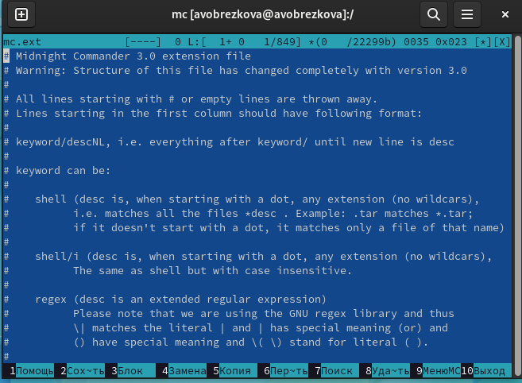{#fig:026 width=70%}

7. Вызвала подменю “Найстройки”. Освоила операции: 

“Конфигурация” - позволяет скорректировать найстройки работы с панелями. (рис. [-@fig:027])

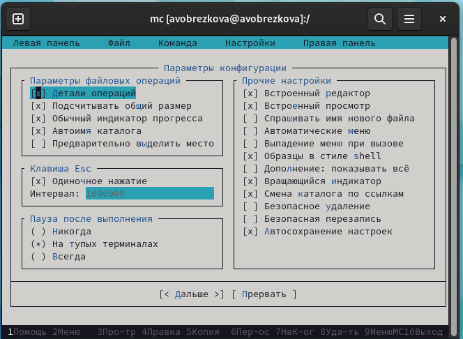{#fig:027 width=70%}

“Внешний вид” и “Настрйока панелей” - помогают определить элементы, отображаемые при вызове mc. (рис. [-@fig:028]; рис. [-@fig:029])

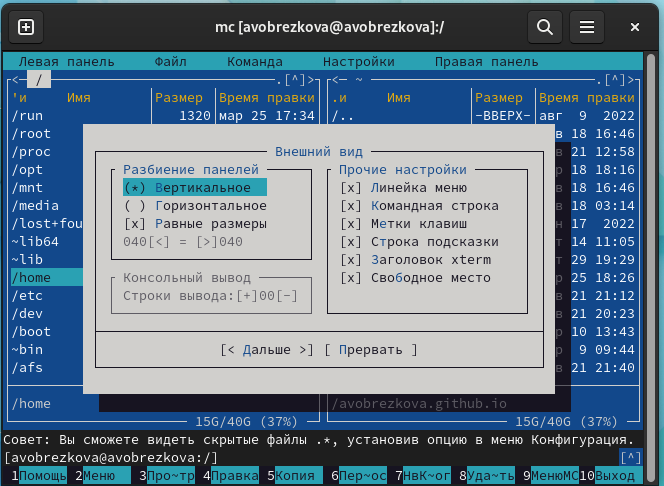{#fig:028 width=70%}

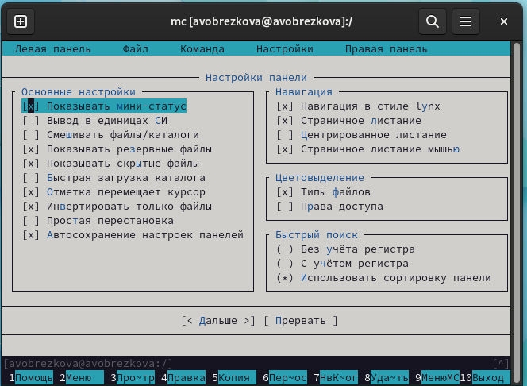{#fig:029 width=70%}

“Подтеждение” помогает установить или убрать вывод окна с запросом подтверждения действий при операциях удаления и перезаписи файлов. (рис. [-@fig:030])

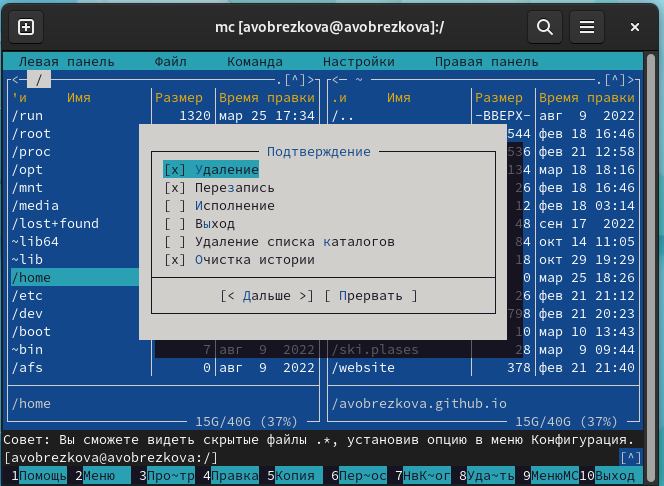{#fig:030 width=70%}

Пунк “Оформление” даёт возможность менять цветовую гамму визуальной оболочки. (рис. [-@fig:031]) 

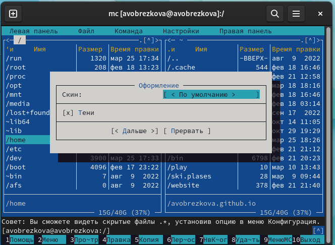{#fig:031 width=70%}

Пункт “Сохранить настройки” сохраняет изменения.(рис. [-@fig:032])

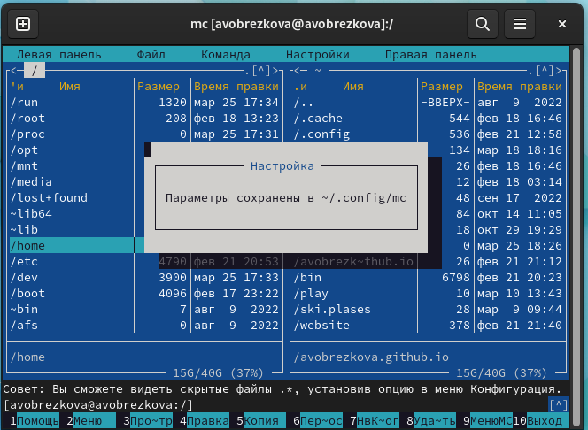{#fig:032 width=70%}

## Задание по встроенному редактору mc

1. Создала текстовый файл “text.txt”, командой “ls” проверила выполнение действий. (рис. [-@fig:033])

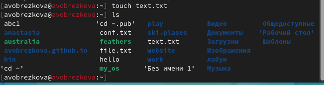{#fig:033 width=70%}

2. Открыла этот файл с помощью встроенного mc редактора с помощью команды “mcedit text.txt”. (рис. [-@fig:034])

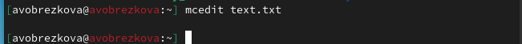{#fig:034 width=70%}

3. Вставила текст из интернета и сделала с ним следующие изменения.(рис. [-@fig:035])

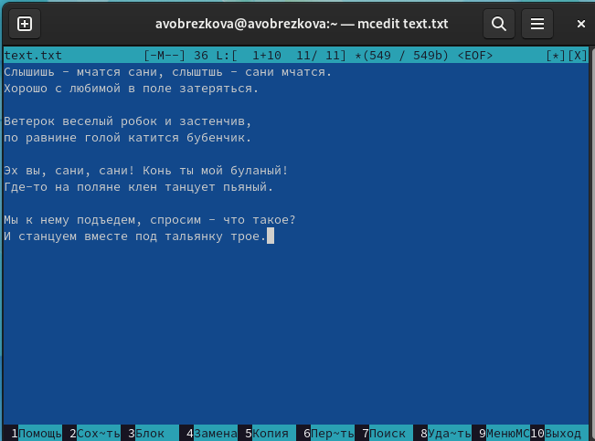{#fig:035 width=70%}

4. Проделала с текстом следующие манипуляции:

Удалила некую строчку стихотворения с помощью команды “F8”, в моем случае удалилась последняя строка.(рис. [-@fig:036])

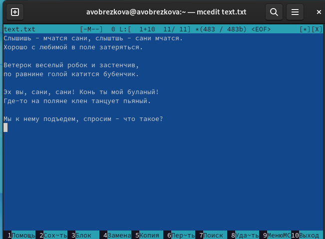{#fig:036 width=70%}

Выделила фрагмент текста с помощью “F3” и скопировала его на новую строку с помощью клавиши ”F5”. (рис. [-@fig:037])

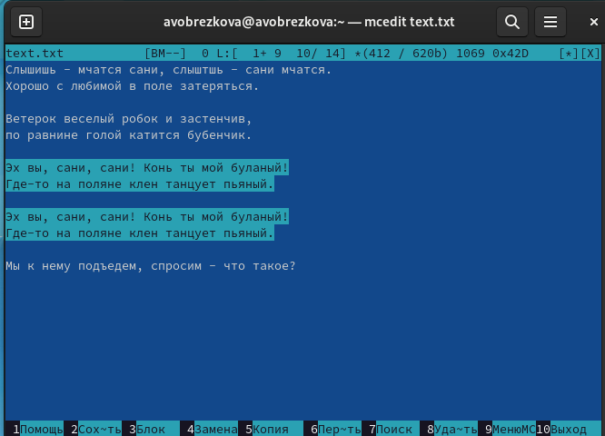{#fig:037 width=70%}

Сохранила файл с помощью клавиши “F2” и отменила последнее действие с помощью клавиш “ctrl+u”.(рис. [-@fig:038])

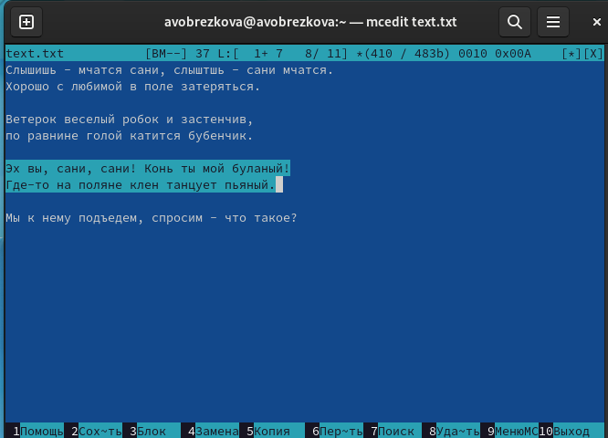{#fig:038 width=70%}

Для перехода в конец файла использовала сочетание клавиш “ctrl+end”, затем написала строчку "Привет, как дела?". (рис. [-@fig:039])

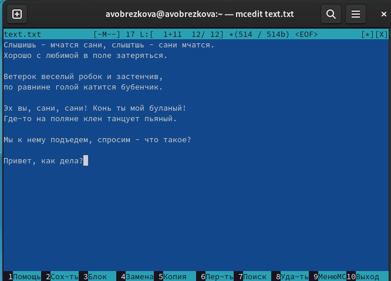{#fig:039 width=70%}

Для перехода в начало использовала “ctrl+home” и написала заголовок. (рис. [-@fig:040])

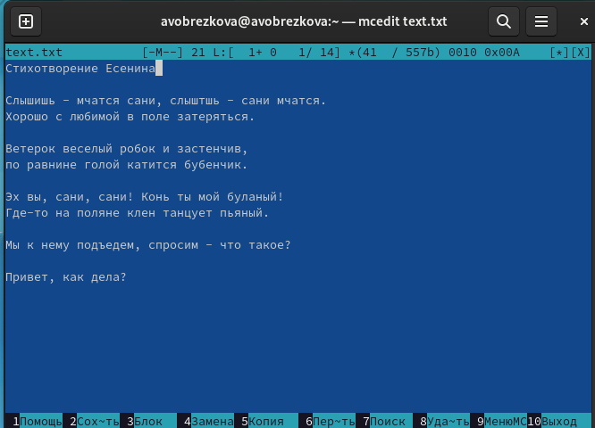{#fig:040 width=70%}

Сохранила файл и вышла в konsole.

5. Открыла файл с исходным текстом на некотором языке прогроммирования, с помощью команды “find / -name *.java”(рис. [-@fig:041])

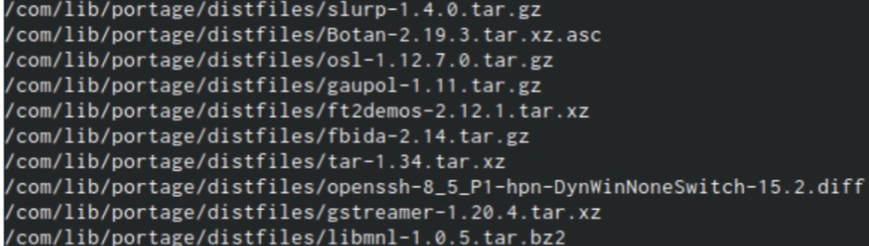{#fig:041 width=70%}

6. Используя меню редактора “Команда” - ”Отключить панели” я смогла включить/выключить подсветку строки.(рис. [-@fig:042])

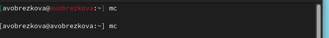{#fig:042 width=70%}

# Выводы

В процессе выполнения лабораторной работы я освоила основные возможности командной оболочки Midnight Commander.
Приобрила навыки практической работы по просмотру каталогов и файлов; манипуляций с ними

# Ответы на контрольные вопросы

1. Какие режимы работы есть в mc. Охарактеризуйте их.

Панели могут дополнительно быть переведены в один из двух режимов: «Информация» или «Дерево». 

В режиме «Информация» на панель выводятся сведения о файле и текущей файловой системе, расположенных на активной
панели. 

В режиме «Дерево» на одной из панелей выводится структура дерева каталогов.

2. Какие операции с файлами можно выполнить как с помощью команд shell, так и с помощью меню (комбинаций клавиш) mc?

Как с помощью команд shell, так и с помощью меню (комбинаций клавиш) mc можно выполнить следующие операции с файлами:

• копирование «F5» («cp имя_файла имя_каталога(в который копируем)»)

• перемещение/переименование «F6»(«mv имя_файла имя_каталога(в который перемещаем)»)

• создание каталога «F7» («mkdir имя_каталога»)

• удаление «F8» («rm имя_файла»)

3. Опишите структура меню левой (или правой) панели mc, дайте характеристику командам.

Перейти в строку меню панелей mc можно с помощью функциональной клавиши «F9». В строке меню имеются пять меню: «Левая панель», «Файл», «Команда», «Настройки» и «Правая панель». 

Подпункт меню «Быстрый просмотр» позволяет выполнить быстрый просмотр содержимого панели. 

Подпункт меню «Информация» позволяет посмотреть информацию о файле или каталоге. 

В меню каждой (левой или правой) панели можно выбрать «Формат списка»:

• стандартный − выводит список файлов и каталогов с указанием размера и времени правки;

• ускоренный − позволяет задать число столбцов, на которые разбивается панель при выводе списка имён файлов или каталогов без дополнительной информации;

• расширенный − помимо названия файла или каталога выводит сведения о правах доступа, владельце, группе, размере, времени правки;

• определённый пользователем − позволяет вывести те сведения о файле или каталоге, которые задаст сам пользователь. 

Подпункт меню «Порядок сортировки» позволяет задать критерии сортировки при выводе списка файлов и каталогов: без сортировки, по имени, расширенный, время правки, время доступа, время изменения атрибута, размер, узел.

4. Опишите структура меню "Файл" mc, дайте характеристику командам.

Команды меню «Файл»:

• Просмотр («F3») − позволяет посмотреть содержимое текущего (или выделенного) файла без возможности редактирования.

• Просмотр вывода команды («М» + «!») − функция запроса команды с параметрами (аргумент к текущему выбранному файлу).

• Правка («F4») − открывает текущий (или выделенный) файл для его редактирования.

• Копирование («F5») − осуществляет копирование одного или нескольких файлов или каталогов в указанное пользователем во всплывающем окне место.

• Права доступа («Ctrl-x» «c») − позволяет указать (изменить) права доступа к одному или нескольким файлам или каталогам.

• Жёсткая ссылка («Ctrl-x» «l») − позволяет создать жёсткую ссылку к текущему (или выделенному) файлу.

• Символическая ссылка («Ctrl-x» «s») − позволяет создать символическую ссылку к текущему (или выделенному) файлу.

• Владелец/группа («Ctrl-x» «o») − позволяет задать (изменить) владельца и имя группы для одного или нескольких файлов или каталогов.

• Права (расширенные) − позволяет изменить права доступа и владения для одного или нескольких файлов или каталогов.

• Переименование («F6») − позволяет переименовать (или переместить) один или несколько файлов или каталогов.

• Создание каталога («F7») − позволяет создать каталог.

• Удалить («F8») − позволяет удалить один или несколько файлов или каталогов.

• Выход («F10») − завершает работу mc.

5. Опишите структура меню Команда mc, дайте характеристику командам.

В меню "Команда" содержатся более общие команды для работы с mc. Команды меню "Команда":

• Дерево каталогов − отображает структуру каталогов системы.

• Поиск файла − выполняет поиск файлов по заданным параметрам.

• Переставить панели − меняет местами левую и правую панели.

• Сравнить каталоги («Ctrl-x» «d») − сравнивает содержимое двух каталогов.

• Размеры каталогов − отображает размер и время изменения каталога (по умолчанию в mc размер каталога корректно не отображается).

• История командной строки − выводит на экран список ранее выполненных в оболочке команд.

• Каталоги быстрого доступа ( Ctrl-») − при вызове выполняется быстрая смена текущего каталога на один из заданного списка.

• Восстановление файлов − позволяет восстановить файлы на файловых системах ext2 и ext3.

• Редактировать файл расширений − позволяет задать с помощью определённого синтаксиса действия при запуске файлов с определённым расширением (например, какое программного обеспечение запускать для открытия или редактирования файлов с расширением doc или docx).

• Редактировать файл меню − позволяет отредактировать контекстное меню пользователя, вызываемое по клавише «F2».

• Редактировать файл расцветки имён − позволяет подобрать оптимальную для пользователя расцветку имён файлов в зависимости от их типа.

6. Опишите структура меню Настройки mc, дайте характеристику командам.

Меню "Настройки" содержит ряд дополнительных опций по внешнему виду и функциональности mc. Меню "Настройки" содержит:

• Конфигурация − позволяет скорректировать настройки работы с панелями.

• Внешний вид и Настройки панелей − определяет элементы (строка меню, командная строка, подсказки и прочее), отображаемые при вызове mc, а также геометрию расположения панелей и цветовыделение.

• Биты символов − задаёт формат обработки информации локальным терминалом.

• Подтверждение − позволяет установить или убрать вывод окна с запросом подтверждения действий при операциях удаления и перезаписи файлов, а также при выходе из программы.

• Распознание клавиш − диалоговое окно используется для тестирования функциональных клавиш, клавиш управления курсором и прочее.

• Виртуальные ФС − настройки виртуальной файловой системы: тайм-аут, пароль и прочее.

7. Назовите и дайте характеристику встроенным командам mc.

Функциональные клавиши mc:

- F1 – вызов контекстно-зависимой подсказки

- F2 – вызов пользовательского меню с возможностью создания и/или дополнения дополнительных функций

- F3 – просмотр содержимого файла, на который указывает подсветка в активной панели (без возможности редактирования)

- F4 – вызов встроенного в mc редактора для изменения содержания файла, на который указывает подсветка в активной панели

- F5 – копирование одного или нескольких файлов, отмеченных в первой (активной) панели, в каталог, отображаемый на второй панели 

- F6 – перенос одного или нескольких файлов, отмеченных в первой (активной) панели, в каталог, отображаемый на второй панели 

- F7 – создание подкаталога в каталоге, отображаемом в активной панели 

- F8 – удаление одного или нескольких файлов (каталогов), отмеченных в первой (активной) панели файлов 

- F9 – вызов менюmc 

- F10 – выход из mc

8. Назовите и дайте характеристику командам встроенного редактора mc.

Встроенный в mc редактор вызывается с помощью функциональной клавиши «F4». В нём удобно использовать различные комбинации клавиш при редактировании содержимого (как правило текстового) файла. Клавиши для редактирования файла:

• «Ctrl-y» − удалить строку

• «Ctrl-u» − отмена последней операции

• «ins» вставка/замена

• «F7» − поиск (можно использовать регулярные выражения)

• «-F7» − повтор последней операции поиска

• «F4» − замена

• «F3» − первое нажатие − начало выделения, второе − окончание выделения

• «F5» − копировать выделенный фрагмент

• «F6» − переместить выделенный фрагмент

• «F8» − удалить выделенный фрагмент

• «F2» − записать изменения в файл

• «F10» − выйти из редактор

9. Дайте характеристику средствам mc, которые позволяют создавать меню, определяемые пользователем.

Для редактирования меню клавишей «F2», необходимо перейти в пункт «Редактировать файлменю» «Команда» и изменить настройки файла. 

10. Дайте характеристику средствам mc, которые позволяют выполнять действия, определяемые пользователем, над текущим файлом.

Часть команд «Меню пользователя», а также меню «Файл» позволяют выполнять действия, определяемые пользователем, над текущим файлом. Например, копирование каталога или файла, переименование, перемещение, архивирование.

