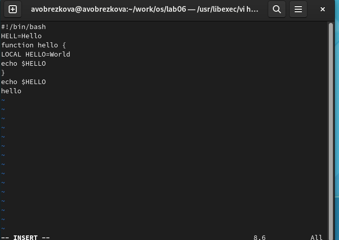

---
## Front matter
lang: ru-RU
title: Лабораторной работы №8
subtitle: Дисциплина "Операционные системы"
author:
  - Обрезкова А.В.
institute:
  - Российский университет дружбы народов, Москва, Россия
  - ФФМиЕН
date: 1 апреля 2023

## i18n babel
babel-lang: russian
babel-otherlangs: english

## Formatting pdf
toc: false
toc-title: Содержание
slide_level: 2
aspectratio: 169
section-titles: true
theme: metropolis
header-includes:
 - \metroset{progressbar=frametitle,sectionpage=progressbar,numbering=fraction}
 - '\makeatletter'
 - '\beamer@ignorenonframefalse'
 - '\makeatother'
---

# Информация

## Докладчик

:::::::::::::: {.columns align=center}
::: {.column width="70%"}

  * Обрезкова Анастасия Владимировна
  * студентка направления "Математика и механика"
  * Российский университет дружбы народов
  * [1132226505@pfur.ru](1132226505@mail.ru)

:::
::: {.column width="30%"}

:::
::::::::::::::

# Вводная часть

## Цель работы

Познакомиться с операционной системой Linux. Получить практические навыки работы с редактором vi, установленным по умолчанию практически во всех дистрибутивах.

# Основная часть

## Создание нового файла с использованием vi

- Создала каталог с именем ~/work/os/lab06 с помощью команды "mkdir -p ~/work/os/lab06"

- Перешла во вновь созданный каталог.

## Создание нового файла с использованием vi

- Вызвала vi и создала файл hello.sh

## Создание нового файла с использованием vi

- Нажала клавишу "i" и ввела следующий текст 

## Создание нового файла с использованием vi

- Нажала клавишу "Esc" для перехода в командный режим после завершения ввода текста.

## Создание нового файла с использованием vi

- Нажала ":" для перехода в режим последней строки и внизу моего экрана появилось приглашение в виде двоеточия.

## Создание нового файла с использованием vi

- Нажала "w" (записать) и "q" (выйти), а затем нажала клавишу "Enter" для сохранения моего текста и завершения работы.

## Создание нового файла с использованием vi

- Сделала файл исполняемым.

## Редактирование существующего файла

- Вызвала vi на редактирование файла с помощью команды "vi ~/work/os/lab06/hello.sh"

## Редактирование существующего файла

- Установила курсор в конец слова HELL второй строки.

## Редактирование существующего файла

- Перешла в режим вставки и заменила на HELLO. Нажала "Esc" для возврата в командный режим.

## Редактирование существующего файла

- Установила курсор на четвертую строку и стерла слово LOCAL.

## Редактирование существующего файла

- Перешла в режим вставки и набрала следующий текст: "local", нажала "Esc" для возврата в командный режим.

## Редактирование существующего файла

- Установила курсор на последней строке файла. Вставилп после неё строку, содержащую следующий текст: "echo $HELLO".

## Редактирование существующего файла

- Нажала "Esc" для перехода в командный режим.

## Редактирование существующего файла

- Удалила последнюю строку с помощью комбинации клавиш, используя сочетание "d", "d".

## Редактирование существующего файла

- Ввела команду отмены изменений "u" для отмены последней команды.

## Редактирование существующего файла

- Ввела символ ":" для перехода в режим последней строки. Записала произведённые изменения, сохранила и вышла из vi..

# Заключение

## Вывод

В ходе выполнения лабораторной работы я познакомилась с операционной системой Linux. Получила практические навыки работы с редактором vi, установленным по умолчанию практически во всех дистрибутивах.

