---
## Front matter
lang: ru-RU
title: Лабораторной работы №10
subtitle: Дисциплина "Операционные системы"
author:
  - Обрезкова А.В.
institute:
  - Российский университет дружбы народов, Москва, Россия
  - ФФМиЕН
date: 13 апреля 2023

## i18n babel
babel-lang: russian
babel-otherlangs: english

## Formatting pdf
toc: false
toc-title: Содержание
slide_level: 2
aspectratio: 169
section-titles: true
theme: metropolis
header-includes:
 - \metroset{progressbar=frametitle,sectionpage=progressbar,numbering=fraction}
 - '\makeatletter'
 - '\beamer@ignorenonframefalse'
 - '\makeatother'
---

# Информация

## Докладчик

:::::::::::::: {.columns align=center}
::: {.column width="70%"}

  * Обрезкова Анастасия Владимировна
  * студентка направления "Математика и механика"
  * Российский университет дружбы народов
  * [1132226505@pfur.ru](1132226505@mail.ru)

:::
::: {.column width="30%"}

:::
::::::::::::::

# Вводная часть

## Цель работы

Изучить основы программирования в оболочке ОС UNIX/Linux. Научиться писать небольшие командные файлы.

# Основная часть

## Программа 1

- Написала скрипт, который при запуске будет делать резервную копию самого себя (то есть файла, в котором содержится его исходный код) в другую директорию backup в моем домашнем каталоге. При этом файл должен архивироваться одним из архиваторов на выбор zip, bzip2 или tar.

## Программа 1

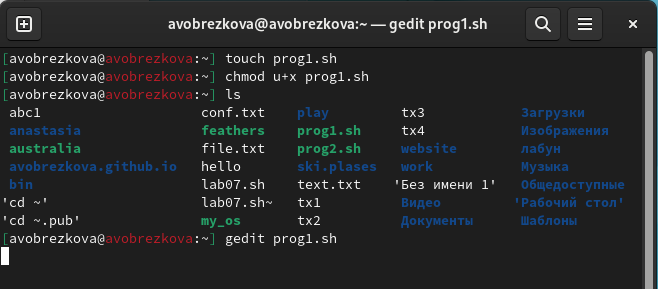

## Программа 1

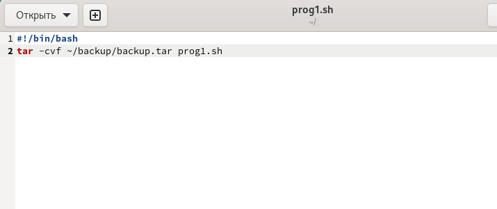

## Программа 1

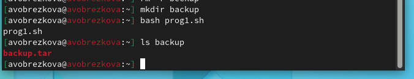

## Программа 2

- Написала пример командного файла, обрабатывающего любое произвольное число аргументов командной строки, в том числе превышающее десять. Например, скрипт может последовательно распечатывать значения всех переданных аргументов.

## Программа 2

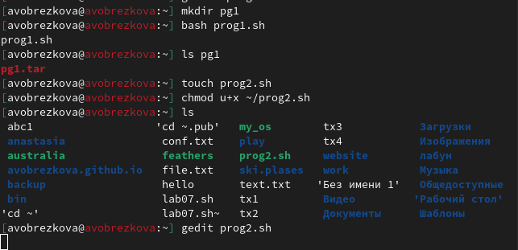

## Программа 2

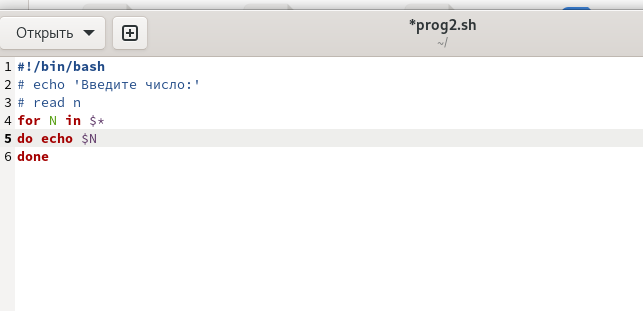

## Программа 2

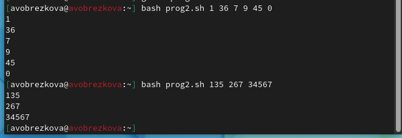

## Программа 3

- Написала командный файл — аналог команды ls (без использования самой этой команды и команды dir). Требуется, чтобы он выдавал информацию о нужном каталоге и выводил информацию о возможностях доступа к файлам этого каталога.

## Программа 3

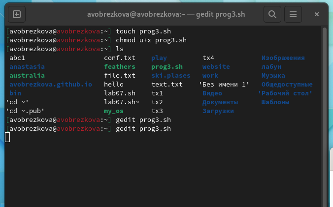

## Программа 3

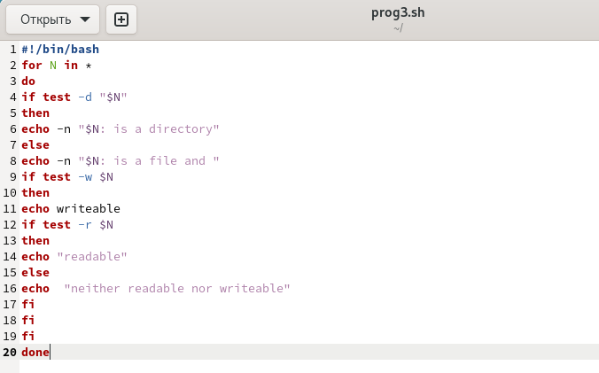

## Программа 3

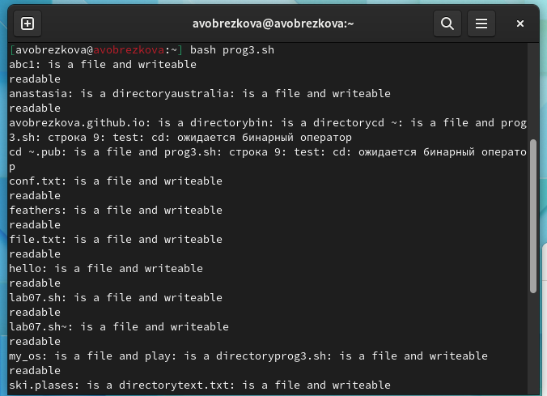

## Программа 4

- Написала командный файл, который получает в качестве аргумента командной строки формат файла (.txt, .doc, .jpg, .pdf и т.д.) и вычисляет количество таких файлов в указанной директории. Путь к директории также передаётся в виде аргумента командной строки.

## Программа 4

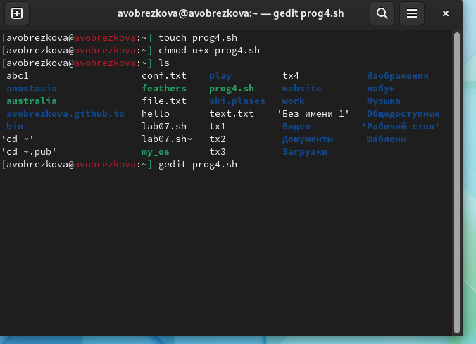

## Программа 4

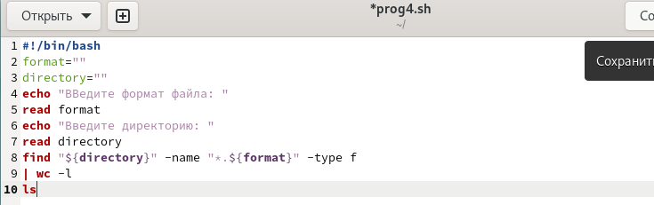

## Программа 4

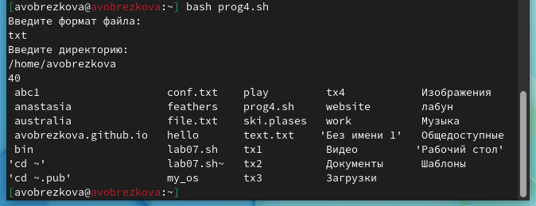

# Заключение

## Вывод

В ходе выполнения лабораторной работы я изучила основы программирования в оболочке ОС UNIX/Linux. Научилась писать небольшие командные файлы.

