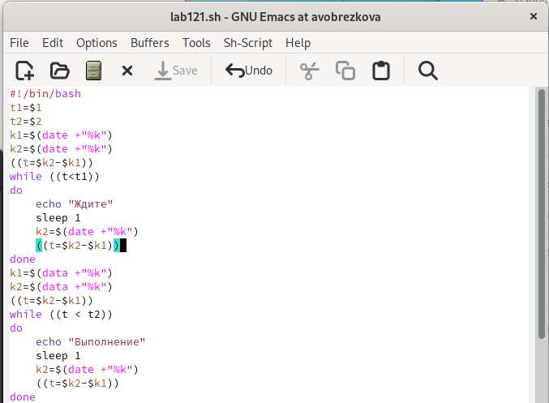
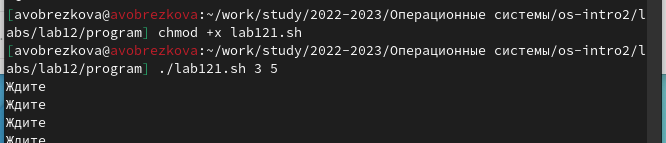
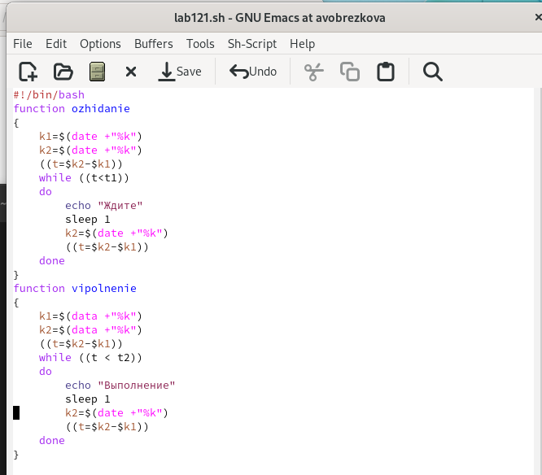
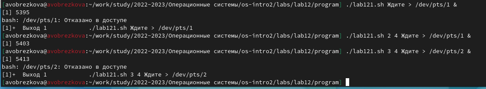
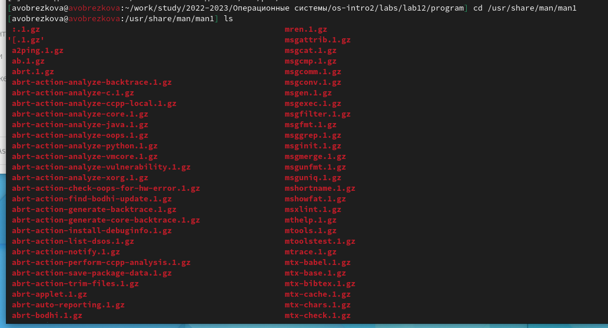
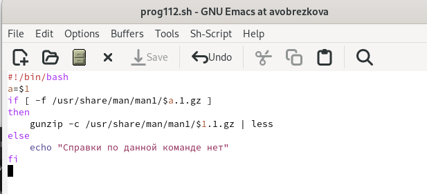
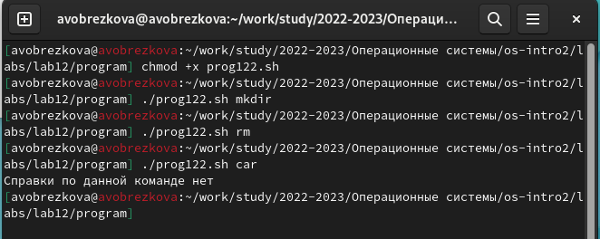
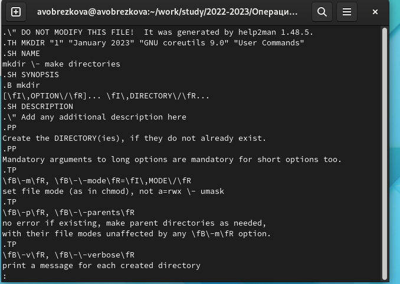
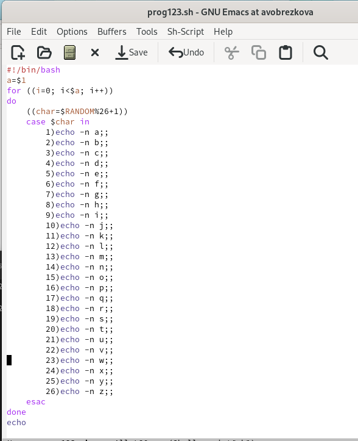
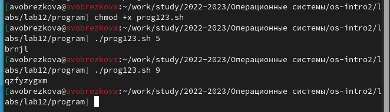

---
## Front matter
lang: ru-RU
title: Лабораторной работы №12
subtitle: Дисциплина "Операционные системы"
author:
  - Обрезкова А.В.
institute:
  - Российский университет дружбы народов, Москва, Россия
  - ФФМиЕН
date: 29 апреля 2023

## i18n babel
babel-lang: russian
babel-otherlangs: english

## Formatting pdf
toc: false
toc-title: Содержание
slide_level: 2
aspectratio: 169
section-titles: true
theme: metropolis
header-includes:
 - \metroset{progressbar=frametitle,sectionpage=progressbar,numbering=fraction}
 - '\makeatletter'
 - '\beamer@ignorenonframefalse'
 - '\makeatother'
---

# Информация

## Докладчик

:::::::::::::: {.columns align=center}
::: {.column width="70%"}

  * Обрезкова Анастасия Владимировна
  * студентка направления "Математика и механика"
  * Российский университет дружбы народов
  * [1132226505@pfur.ru](1132226505@mail.ru)

:::
::: {.column width="30%"}

:::
::::::::::::::

# Вводная часть

## Цель работы

Изучить основы программирования в оболочке ОС UNIX. Научиться писать более сложные командные файлы с использованием логических управляющих конструкций и циклов.

# Основная часть

## Программа 1

- Для данной задачи я создала файл: lab121.sh и написала соответствующий скрипт

## Программа 1

## Программа 1

- После этого я изменила скрипт так, чтобы его можно было выполнять в нескольких терминалах и проверила его работу.

## Программа 1 

## Программа 1

- Но ни одна команда не работала, так как мне было "Отказано в доступе". При этом скрипт работает корректно.

## Программа 2

## Программа 2

- Для данной задачи я создала файл: prod122.sh и написала соответствующий скрипт

## Программа 2

## Программа 2

## Программа 3

- Используя встроенную переменную $RANDOM, написала командный файл, генерирующий случайную последовательность букв латинского алфавита. Для данной задачи я создала файл: prog123.sh и написал соответствующий скрипт.

## Программа 3

## Программа 3

# Заключение

## Вывод

В ходе выполнения данной лабораторной работы я изучила основы программирования в оболочке ОС UNIX, а также научилась писать более сложные командные файлы с использованием логических управляющих конструкций и циклов.

