---
## Front matter
lang: ru-RU
title: Лабораторной работы №13
subtitle: Дисциплина "Операционные системы"
author:
  - Обрезкова А.В.
institute:
  - Российский университет дружбы народов, Москва, Россия
  - ФФМиЕН
date: 6 мая 2023

## i18n babel
babel-lang: russian
babel-otherlangs: english

## Formatting pdf
toc: false
toc-title: Содержание
slide_level: 2
aspectratio: 169
section-titles: true
theme: metropolis
header-includes:
 - \metroset{progressbar=frametitle,sectionpage=progressbar,numbering=fraction}
 - '\makeatletter'
 - '\beamer@ignorenonframefalse'
 - '\makeatother'
---

# Информация

## Докладчик

:::::::::::::: {.columns align=center}
::: {.column width="70%"}

  * Обрезкова Анастасия Владимировна
  * студентка направления "Математика и механика"
  * Российский университет дружбы народов
  * [1132226505@pfur.ru](1132226505@mail.ru)

:::
::: {.column width="30%"}

:::
::::::::::::::

# Вводная часть

## Цель работы

Приобрести простейшие навыки разработки, анализа, тестирования и отладки приложений в ОС типа UNIX/Linux на примере создания на языке программирования С калькулятора с простейшими функциями.

#Основная часть

## Выполнение лабораторной работы

- В домашнем каталоге создаём подкаталог "~/work/os/lab_prog" с помощью комнады "mkdir".

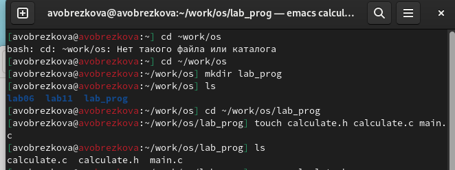

##

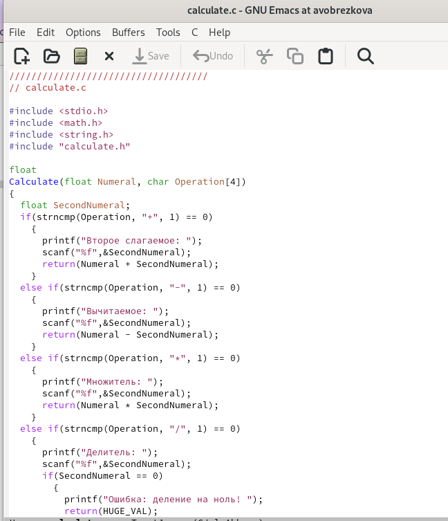

##

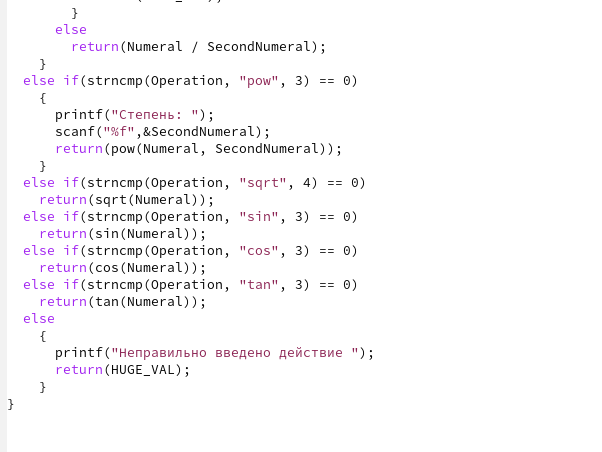

##

Интерфейсный файл calculate.h, описывающий формат вызова функции калькулятора.

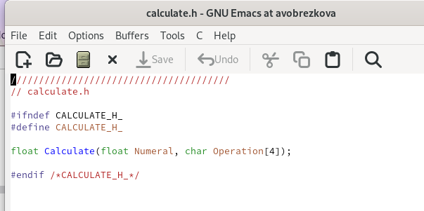

##

Основной файл main.c, реализующий интерфейс пользователя к калькулятору. 

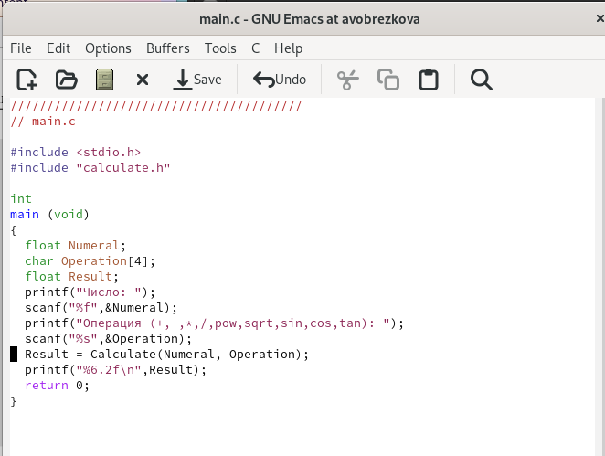

## 

- Далее выполним компиляцию программы посредством gcc. 

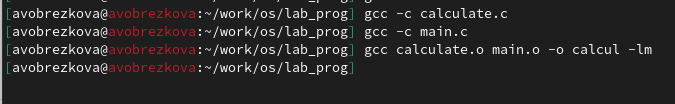

- Ошибок не выявлено

##

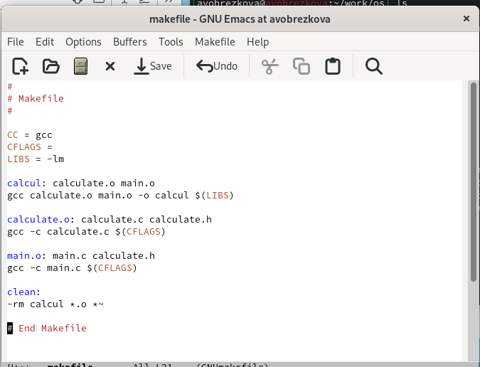

##

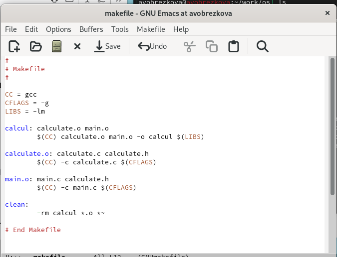

##

После выполняем компиляцию файлов. 

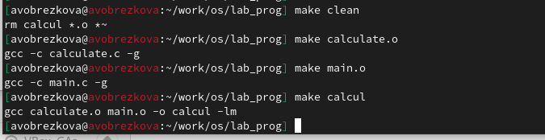

## 

После этого выполняем gdb отладку программмы calcul. Запускаем GDB и
загружаем в него программу для отладки, используя команду “gdb ./calcul”

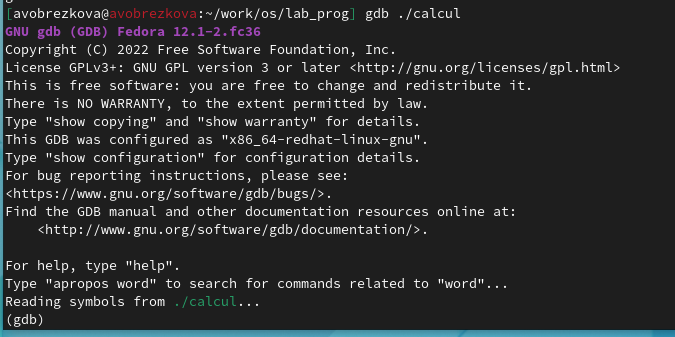

##

Далее вводим комнаду “run” для запуска программы внутри откадчика.

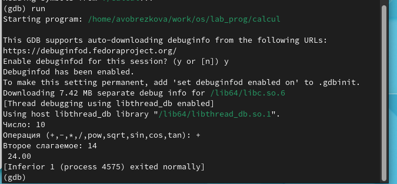

##

Для постраничего просмотра исходного кода используем команду “list”.

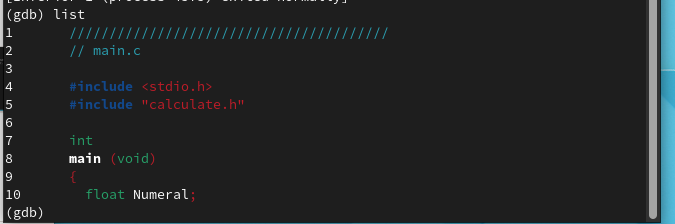

##

Для просмотра строк с 12 по 15 основного файла используем команду “list 12,15”.

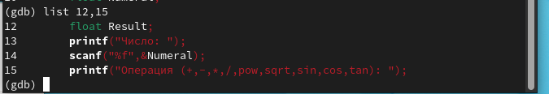

##

Для просмотра определённых строк не основного файла используем команду
“list calculate.c:20,29”.

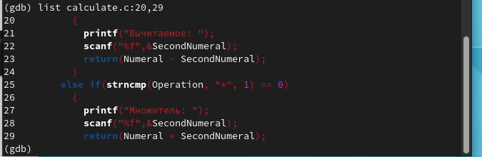

##

Для установки точки в файле “calculate.c” на строке 21 используем команды “list calculate.c:20,27” и “break 21”.

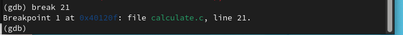

##

Чтобы вывесни информацию об имеющихся точках останова используем команду “info breakpoint”

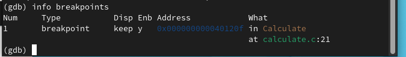

##

Запустим программу внутри отладчика и убедимся, что программа остановилась в момент прохождения точки останова.

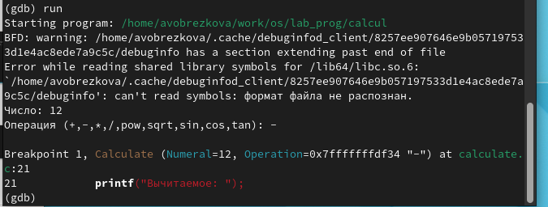

##

Посмотрим, чему на этом этапе равно значение переменной Numeral, с помощью команды “print Numeral” и сравним его с результатом вывода на экарн после использования команды “display Numeral”. Значения совпадают.

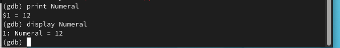

##

Уберём точки останова с помощью команды “d breakpoints”

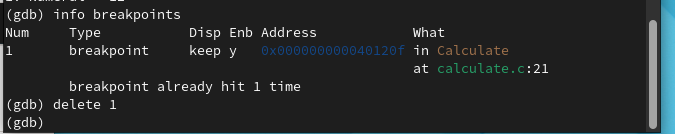

##

- С помощью утилиты splint проанализировала коды файлов calculate.c и main.c.

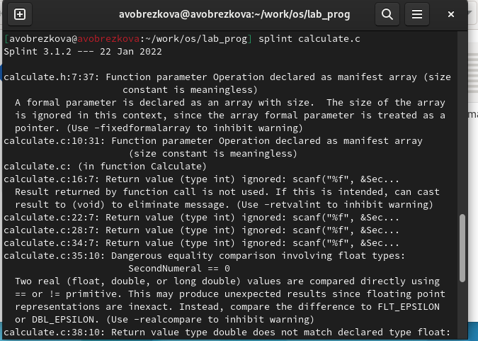

##

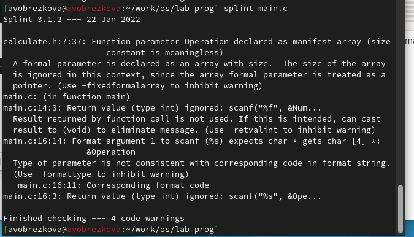

# Заключение

## Выводы

В ходе выполнения данной лабораторной работы я приобрела простейшие навыки разработки, анализа, тестирования и отладки приложений в OC типа UNIX/Linux на примере создания на языке программирования С калькулятора с простейшими функциями.

