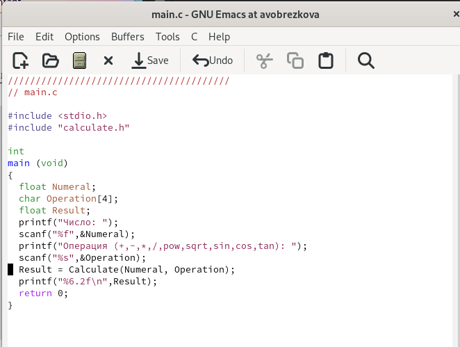
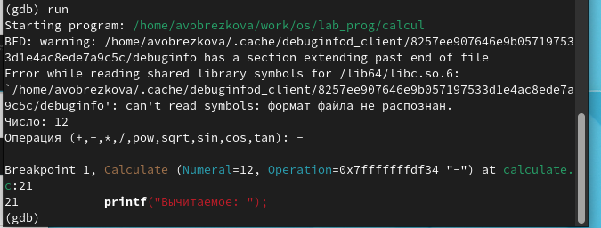

---
## Front matter
title: "Отчёт по лабораторной работе №13"
subtitle: "Операционные системы"
author: "Обрезкова Анастасия Владимировна"

## Generic otions
lang: ru-RU
toc-title: "Содержание"

## Bibliography
bibliography: bib/cite.bib
csl: pandoc/csl/gost-r-7-0-5-2008-numeric.csl

## Pdf output format
toc: true # Table of contents
toc-depth: 2
lof: true # List of figures
lot: false # List of tables
fontsize: 12pt
linestretch: 1.5
papersize: a4
documentclass: scrreprt
## I18n polyglossia
polyglossia-lang:
  name: russian
  options:
	- spelling=modern
	- babelshorthands=true
polyglossia-otherlangs:
  name: english
## I18n babel
babel-lang: russian
babel-otherlangs: english
## Fonts
mainfont: PT Serif
romanfont: PT Serif
sansfont: PT Sans
monofont: PT Mono
mainfontoptions: Ligatures=TeX
romanfontoptions: Ligatures=TeX
sansfontoptions: Ligatures=TeX,Scale=MatchLowercase
monofontoptions: Scale=MatchLowercase,Scale=0.9
## Biblatex
biblatex: true
biblio-style: "gost-numeric"
biblatexoptions:
  - parentracker=true
  - backend=biber
  - hyperref=auto
  - language=auto
  - autolang=other*
  - citestyle=gost-numeric
## Pandoc-crossref LaTeX customization
figureTitle: "Рис."
tableTitle: "Таблица"
listingTitle: "Листинг"
lofTitle: "Список иллюстраций"
lotTitle: "Список таблиц"
lolTitle: "Листинги"
## Misc options
indent: true
header-includes:
  - \usepackage{indentfirst}
  - \usepackage{float} # keep figures where there are in the text
  - \floatplacement{figure}{H} # keep figures where there are in the text
---

# Цель работы

Приобрести простейшие навыки разработки, анализа, тестирования и отладки приложений в ОС типа UNIX/Linux на примере создания на языке программирования С калькулятора с простейшими функциями.

# Выполнение лабораторной работы

1. В домашнем каталоге создаём подкаталог "~/work/os/lab_prog" с помощью комнады "mkdir".(рис. @fig:001).

{#fig:001 width=50%}

2. Затем перейдём в каталог и создадим файлы: calculate.h, calculate.c, main.c. Делаю это с помощью команды “touch”.(рис. @fig:002).

{#fig:002 width=50%}

Создадим примитинейший калькулятор, способный складывать, вычитать, умножать и делить, возводить число в степень, брать квадратный корень, вычислять sin,cos,tan. При запуске он будет запрашивать первое число, операцию,второе число. После этого программа выведет результат и остановится. Реализация функций калькулятора будет делать в файле calculate.c.(рис. @fig:003), (рис. @fig:004).

{#fig:003 width=30%}

{#fig:004 width=30%}

Интерфейсный файл calculate.h, описывающий формат вызова функции калькулятора.(рис. @fig:005).

{#fig:005 width=50%}

Основной файл main.c, реализующий интерфейс пользователя к калькулятору. (рис. @fig:006).

{#fig:006 width=40%}

3. Далее выполним компиляцию программы посредством gcc. (рис. @fig:007).

{#fig:007 width=50%}

4. Ошибок не выявлено

5. Создадим Makefile c необходимым содержанием. Он необходим для автоматической компиляции файлов calculate.c (цель calculate.o), main.c (цель main.o), а так же их объединения в один исполняемый файл calcul. Цель “clean” нужна доя автоматического удаления файлов. Переменная “CC” отвечает за утилиту для компиляции. Переменная “CFLAGS” отвечает за опции в данной утилите. Переменная “LIBS” отвечает за опции для объединения объектных файлов в один исполняемый файл.(рис. @fig:008).

{#fig:008 width=40%}

6. Далее изменим файл. В переменную CFLAGS добавим “-g”, которая необходима для компиляции объектных файлов и их использования в программе отладчика GDB. Также, компиляция выбирается с помощью переменной СС.(рис. @fig:009)

{#fig:009 width=40%}

После выполняем компиляцию файлов. (рис. @fig:010)

{#fig:010 width=50%}

После этого выполняем gdb отладку программмы calcul. Запускаем GDB и загружаем в него программу для отладки, используя команду “gdb ./calcul”(рис. @fig:011)

{#fig:011 width=40%}

Далее вводим комнаду “run” для запуска программы внутри откадчика.(рис. @fig:012)

{#fig:012 width=40%}

Для постраничего просмотра исходного кода используем команду “list”.(рис. @fig:013)

{#fig:013 width=40%}

Для просмотра строк с 12 по 15 основного файла используем команду “list 12,15”.(рис. @fig:014)

{#fig:014 width=40%}

Для просмотра определённых строк не основного файла используем команду “list calculate.c:20,29”.(рис. @fig:015)

{#fig:015 width=40%}

Для установки точки в файле “calculate.c” на строке 21 используем команды “list calculate.c:20,27” и “break 21”.(рис. @fig:016)

{#fig:016 width=50%}

Чтобы вывесни информацию об имеющихся точках останова используем команду “info breakpoint”(рис. @fig:017)

{#fig:017 width=50%}

Запустим программу внутри отладчика и убедимся, что программа остановилась в момент прохождения точки останова.(рис. @fig:018)

{#fig:018 width=50%}

Посмотрим, чему на этом этапе равно значение переменной Numeral, с помощью команды “print Numeral” и сравним его с результатом вывода на экарн после использования команды “display Numeral”. Значения совпадают.(рис. @fig:019)

{#fig:019 width=50%}

Уберём точки останова с помощью команды “info breakpoints”(рис. @fig:020)

{#fig:020 width=50%}

7. С помощью утилиты splint проанализировала коды файлов calculate.c и main.c.(рис. @fig:021), (рис. @fig:022)

{#fig:021 width=50%}

{#fig:022 width=50%}

Данные изменения можно проверить по ссылке: [https://github.com/avobrezkova/study_2022-2023_os-intro/tree/master/labs/lab13](https://github.com/avobrezkova/study_2022-2023_os-intro/tree/master/labs/lab13)

# Выводы

В ходе выполнения данной лабораторной работы я приобрела простейшие навыки разработки, анализа, тестирования и отладки приложений в OC типа UNIX/Linux на примере создания на языке программирования С калькулятора с простейшими функциями.

# Ответы на контрольные вопросы 

1. ак получить информацию о возможностях программ gcc, make, gdb и др.?

Чтобы получить информацию о возможностях программ gcc, make, gdb и др. нужно воспользоваться командой man или опцией -help (-h) для каждой команды.

2. Назовите и дайте краткую характеристику основным этапам разработки приложений в UNIX.

Процесс разработки программного обеспечения обычно разделяется на следующие этапы:

• планирование, включающее сбор и анализ требований к функционалу и другим характеристикам разрабатываемого приложения;

• проектирование, включающее в себя разработку базовых алгоритмов и спецификаций, определение языка программирования;

• непосредственная разработка приложения:

– кодирование − по сути создание исходного текста программы (возможно в нескольких вариантах); – анализ разработанного кода;

– сборка, компиляция и разработка исполняемого модуля;

– тестирование и отладка, сохранение произведённых изменений;

• документирование. Для создания исходного текста программы разработчик может воспользоваться любым удобным для него редактором текста: vi, vim, mceditor, emacs, geany и др. После завершения написания исходного кода программы (возможно состоящей из нескольких файлов), необходимо её скомпилировать и получить исполняемый модуль.

3. Что такое суффикс в контексте языка программирования? Приведите примеры использования.

Для имени входного файла суффикс определяет какая компиляция требуется. Суффиксы указывают на тип объекта. Файлы с расширением (суффиксом).c воспринимаются gcc как программы на языке С, файлы с расширением .cc или .C − как файлы на языке C++, а файлы c расширением .o считаются объектными. Например, в команде «gcc -c main.c»: gcc по расширению (суффиксу) .c распознает тип файла для компиляции и формирует объектный модуль − файл с расширением .o. Если требуется получить исполняемый файл с определённым именем (например, hello), то требуется воспользоваться опцией -o и в качестве параметра задать имя создаваемого файла: «gcc -o hello main.c».

4. Каково основное назначение компилятора языка С в UNIX?

Основное назначение компилятора языка Си в UNIX заключается в компиляции всей программы и получении исполняемого файла/модуля.

5. ля чего предназначена утилита make?

Для сборки разрабатываемого приложения и собственно компиляции полезно воспользоваться утилитой make. Она позволяет автоматизировать процесс преобразования файлов программы из одной формы в другую, отслеживает взаимосвязи между файлами.

6. Приведите пример структуры Makefile. Дайте характеристику основным элементам этого файла.

Для работы с утилитой make необходимо в корне рабочего каталога с Вашим проектом создать файл с названием makefile или Makefile, в котором будут описаны правила обработки файлов Вашего программного комплекса. В самом простом случае Makefile имеет следующий синтаксис: ... : ... <команда 1> ... Сначала задаётся список целей, разделённых пробелами, за которым идёт двоеточие и список зависимостей. Затем в следующих строках указываются команды. Строки с командами обязательно должны начинаться с табуляции. В качестве цели в Makefile может выступать имя файла или название какого-то действия. Зависимость задаёт исходные параметры (условия)для достижения указанной цели. Зависимость также может быть названием какого-то действия. Команды − собственно действия, которые необходимо выполнить для достижения цели. Общий синтаксис Makefile имеет вид: target1 [target2...]:[:] [dependment1...] [(tab)commands] [#commentary]
[(tab)commands] [#commentary] Здесь знак # определяет начало комментария (содержимое от знака # и до конца строки не будет обрабатываться.

Одинарное двоеточие указывает на то, что последовательность команд должна содержаться в одной строке. Для переноса можно в длинной строке команд можно использовать обратный слэш (). Двойное двоеточие указывает на то, что последовательность команд может содержаться в нескольких последовательных строках. Пример более сложного синтаксиса Makefile:

Makefile for abcd.c # CC = gcc CFLAGS = #Compile abcd.c normaly abcd: abcd.c

$(CC) -o abcd $(CFLAGS) abcd.c clean: -rm abcd .o ~ #End Makefile for abcd.c В этом примере в начале файла заданы три переменные: CC и CFLAGS. Затем указаны цели, их зависимости и соответствующие команды. В командах происходит обращение к значениям переменных. Цель с именем clean производит очистку каталога от файлов, полученных в результате компиляции.
Для её описания использованы регулярные выражения.

7. Назовите основное свойство, присущее всем программам отладки. Что необходимо сделать, чтобы его можно было использовать?

Во время работы над кодом программы программист неизбежно сталкивается с появлением ошибок в ней. Использование отладчика для поиска иустранения ошибок в программе существенно облегчает жизнь программиста. В комплект программ GNU для ОС типа UNIX входит отладчик GDB (GNU Debugger). Для использования GDB необходимо скомпилировать анализируемый код программы таким образом, чтобы отладочная информация содержалась в результирующем бинарном файле. Для этого следует воспользоваться опцией -g компилятора gcc: gcc -c file.c -g После этого для начала работы с gdb необходимо в командной строке ввести одноимённую команду, указав в качестве аргумента анализируемый бинарный файл: gdb
file.o

8. Назовите и дайте основную характеристику основным командам отладчика gdb.

Основные команды отладчика gdb:
- backtrace − вывод на экран пути к текущей точке останова (по сути вывод −названий всех функций)
- break − установить точку останова (в качестве параметра может быть указанномер строки или название функции)
- clear − удалить все точки останова в функции
- continue − продолжить выполнение программы
- delete − удалить точку останова
- display − добавить выражение в список выражений, значения которых отображаются при достижении точки останова программы
- finish − выполнить программу до момента выхода из функции
- info breakpoints − вывести на экран список используемых точек останова
- info watchpoints − вывести на экран список используемых контрольных выражений
- list − вывести на экран исходный код (в качестве параметра может быть указано название файла и через двоеточие номера начальной и конечной строк)
- next − выполнить программу пошагово, но без выполнения вызываемых в программе функций
- print − вывести значение указываемого в качестве параметра выражения
- run − запуск программы на выполнение
- set − установить новое значение переменной
- step − пошаговое выполнение программы
- watch − установить контрольное выражение, при изменении значения которого программа будет остановлена Для выхода из gdb можно воспользоваться командой quit (или её сокращённым вариантом q) или комбинацией клавиш Ctrl-d. Более подробную информацию по работе с gdb можно получить с помощью команд gdb -h и man gdb.

9. Опишите по шагам схему отладки программы, которую Вы использовали при выполнении лабораторной работы.

Cхема отладки программы показана в 6 пункте лабораторной работы.

10. Прокомментируйте реакцию компилятора на синтаксические ошибки в программе при его первом запуске.

При первом запуске компилятор не выдал никаких ошибок, но в коде программы main.c допущена ошибка, которую компилятор мог пропустить (возможно, из-за версии 8.3.0-19): в строке scanf(“%s”, &Operation); нужноубрать знак &, потому что имя массива символов уже является указателем на первый элемент этого массива.

11. Назовите основные средства, повышающие понимание исходного кода программы.

Система разработки приложений UNIX предоставляет различные средства, повышающие понимание исходного кода. К ним относятся:

- cscope − исследование функций, содержащихся в программе,

- lint − критическая проверка программ, написанных на языке Си.

12. Каковы основные задачи, решаемые программой splint?

Утилита splint анализирует программный код, проверяет корректность задания аргументов использованных в программе функций и типов возвращаемых значений, обнаруживает синтаксические и семантические ошибки. В отличие от компилятора C анализатор splint генерирует комментарии с описанием разбора кода программы и осуществляет общий контроль, обнаруживая такие ошибки, как одинаковые объекты, определённые в разных файлах, или объекты, чьи значения не используются в работ программы, переменные с некорректно заданными значениями и типами и многое другое

