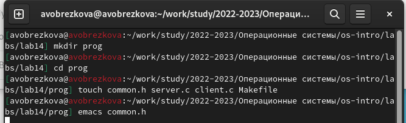
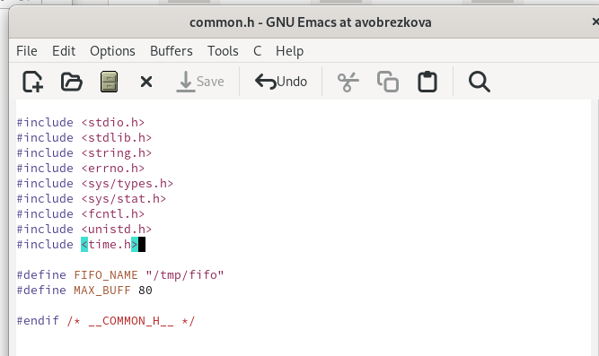
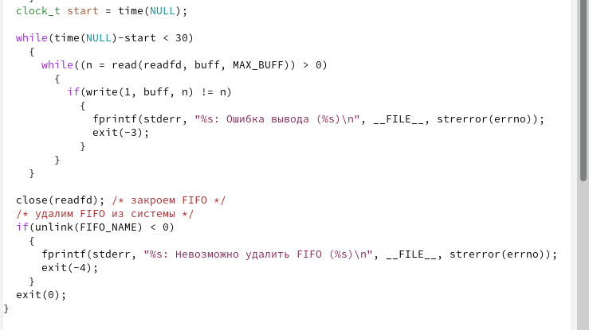
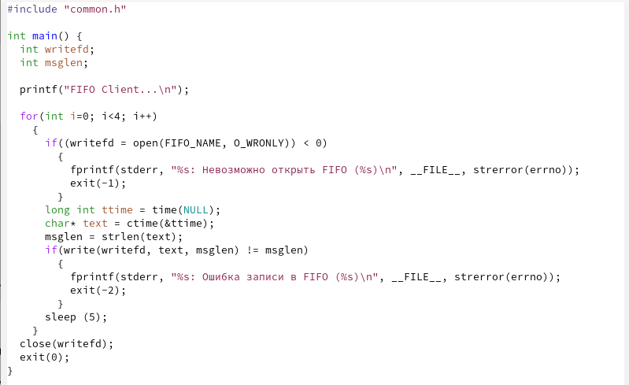
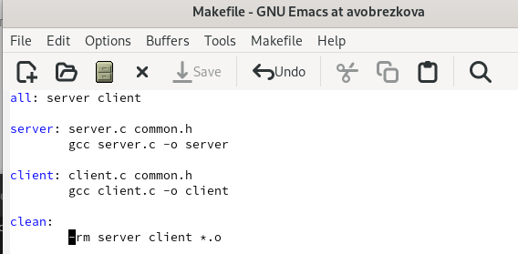
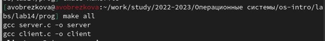
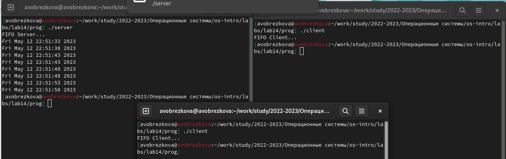

---
## Front matter
lang: ru-RU
title: Лабораторной работы №14
subtitle: Дисциплина "Операционные системы"
author:
  - Обрезкова А.В.
institute:
  - Российский университет дружбы народов, Москва, Россия
  - ФФМиЕН
date: 12 мая 2023

## i18n babel
babel-lang: russian
babel-otherlangs: english

## Formatting pdf
toc: false
toc-title: Содержание
slide_level: 2
aspectratio: 169
section-titles: true
theme: metropolis
header-includes:
 - \metroset{progressbar=frametitle,sectionpage=progressbar,numbering=fraction}
 - '\makeatletter'
 - '\beamer@ignorenonframefalse'
 - '\makeatother'
---

# Информация

## Докладчик

:::::::::::::: {.columns align=center}
::: {.column width="70%"}

  * Обрезкова Анастасия Владимировна
  * студентка направления "Математика и механика"
  * Российский университет дружбы народов
  * [1132226505@pfur.ru](1132226505@mail.ru)

:::
::: {.column width="30%"}

:::
::::::::::::::

# Вводная часть

## Цель работы

- Приобретение практических навыков работы с именованными каналами.

# Основная часть

## Выполнение лабораторной работы

- Для начала я создала необходимые файлы с помощью команды «touch common.h server.c client.c Makefile»

##

- В файл common.h добавила стандартные заголовочные файлы unistd.h и time.h, необходимые для работы кодов других файлов. Common.h предназначен для заголовочных файлов, чтобы в остальных программах их не прописывать каждый раз

## 

- В файл server.c добавила цикл while для контроля за временем работы сервера. Разница между текущим временем time(NULL) и временем начала работы clock_t start=time(NULL) (инициализация до цикла) не должна превышать 30 секунд

## 

- В файл client.c добавила цикл, который отвечает за количество сообщений о текущем времени (4 сообщения), которое получается в результате выполнения команд, и команду sleep(5) для приостановки работы клиента на 5 секунд 

## 

- Makefile (файл для сборки) не изменяла

## 

- После написания кодов, я, используя команду «make all», скомпилировала необходимые файлы

## 

- Отрыла 3 консоли (терминала) и запустила: в первом терминале − «./server», в остальных двух – «./client». В результате каждый терминал-клиент вывел по 4 сообщения. Спустя 30 секунд работа сервера была прекращена

# Заключение

## Вывод

В ходе выполнения данной лабораторной работы я приобрёлf практические навыки работы с именованными каналами.

