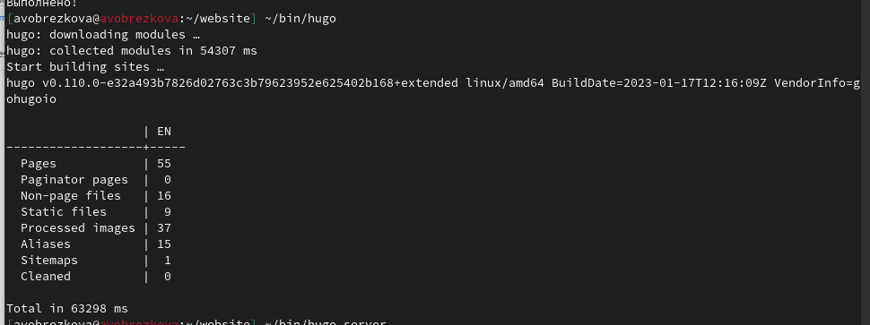

---
## Front matter
lang: ru-RU
title: Индивидуальный проект этап №1
subtitle: Дисциплина "Операционные системы"
author:
  - Обрезкова А.В.
institute:
  - Российский университет дружбы народов, Москва, Россия
  - ФФМиЕН
date: 22 февраля 2023

## i18n babel
babel-lang: russian
babel-otherlangs: english

## Formatting pdf
toc: false
toc-title: Содержание
slide_level: 2
aspectratio: 169
section-titles: true
theme: metropolis
header-includes:
 - \metroset{progressbar=frametitle,sectionpage=progressbar,numbering=fraction}
 - '\makeatletter'
 - '\beamer@ignorenonframefalse'
 - '\makeatother'
---

# Информация

## Докладчик

:::::::::::::: {.columns align=center}
::: {.column width="70%"}

  * Обрезкова Анастасия Владимировна
  * студентка направления "Математика и механика"
  * Российский университет дружбы народов
  * [1132226505@pfur.ru](1132226505@mail.ru)

:::
::: {.column width="30%"}

:::
::::::::::::::

# Вводная часть

## Цель работы

- Размещение на GitHub pages заготовки для персонального сайта.

## Задачи

- Установить необходимое программное обеспечение.

- Скачать шаблон темы сайта.

- Разместить его на хостинге git.

- Установить параметр для URLs сайта.

- Разместить заготовку сайта на Github pages.

# Основная часть

## Установка архива Hugo

- Скачала архив с репозитория

## Разорхивация

- Разархивировала, скопировала файл hugo и поместила его в в новую папку bin

## Создание репозитория

- Создала новый репозиторий website с шаблона

## Клонирование репозитория

## Команда ~/bin/hugo

- Перешла в website и выполнила команду '~/bin/hugo'

## Команда ~/bin/hugo server

## Команда ~/bin/hugo server

## Создание репозитория

- Создала еще один новый репозиторий с названием "avobrezkova.github.io"

## Клонирование репозитория

- Вывела содержание домашнего каталога и клонировала репозиторий в данный каталог

## Создание ветки

- Создала новую ветку main и создала файл README.md

## Создание ветки

## Присоединение репозитория

- Присоединили новый репозиторий к папке public

## Присоединение репозитория

-  Выдалась ошибка, поэтому я поставили "#" возле public, чтобы исправить ошибку, повторила команду и получила папку с одним файлом README.md

## Команда ~/bin/hugo

- Ввела команду "~/bin/hugo", появились новые файлы

## Синхронизация файлов

- Синхронизировала файлы с репозиторием

## Загрузка на GitHub

## Загрузка на GitHub

## Сайт

# Заключение

## Вывод

В ходе выполнения лабораторной работы я разместила на GitHub pages заготовки для персонального сайта.

