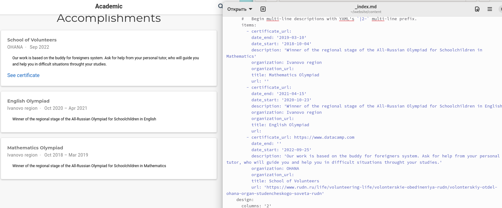
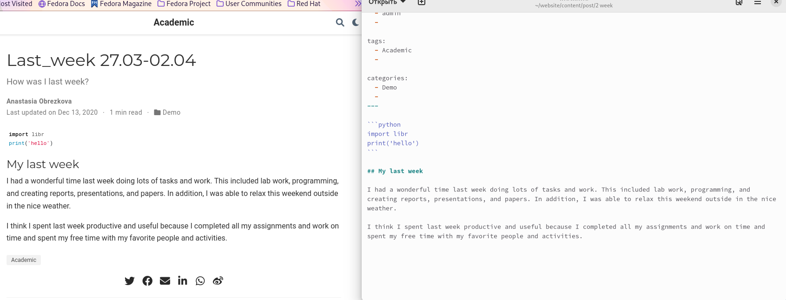

---
## Front matter
title: "Отчет по индивидуальному проекту. Этап №3"
subtitle: "Дисциплина: Операционные системы"
author: "Обрезкова Анастасия Владимировна"

## Generic otions
lang: ru-RU
toc-title: "Содержание"

## Bibliography
bibliography: bib/cite.bib
csl: pandoc/csl/gost-r-7-0-5-2008-numeric.csl

## Pdf output format
toc: true # Table of contents
toc-depth: 2
lof: true # List of figures
lot: true # List of tables
fontsize: 12pt
linestretch: 1.5
papersize: a4
documentclass: scrreprt
## I18n polyglossia
polyglossia-lang:
  name: russian
  options:
	- spelling=modern
	- babelshorthands=true
polyglossia-otherlangs:
  name: english
## I18n babel
babel-lang: russian
babel-otherlangs: english
## Fonts
mainfont: PT Serif
romanfont: PT Serif
sansfont: PT Sans
monofont: PT Mono
mainfontoptions: Ligatures=TeX
romanfontoptions: Ligatures=TeX
sansfontoptions: Ligatures=TeX,Scale=MatchLowercase
monofontoptions: Scale=MatchLowercase,Scale=0.9
## Biblatex
biblatex: true
biblio-style: "gost-numeric"
biblatexoptions:
  - parentracker=true
  - backend=biber
  - hyperref=auto
  - language=auto
  - autolang=other*
  - citestyle=gost-numeric
## Pandoc-crossref LaTeX customization
figureTitle: "Рис."
tableTitle: "Таблица"
listingTitle: "Листинг"
lofTitle: "Список иллюстраций"
lotTitle: "Список таблиц"
lolTitle: "Листинги"
## Misc options
indent: true
header-includes:
  - \usepackage{indentfirst}
  - \usepackage{float} # keep figures where there are in the text
  - \floatplacement{figure}{H} # keep figures where there are in the text
---
# Цель работы

Добавить к сайту достижения.

# Задачи

- Добавить информацию о навыках (Skills).

- Добавить информацию об опыте (Experience).

- Добавить информацию о достижениях (Accomplishments).

- Сделать пост по прошедшей неделе.

- Добавить пост на тему по выбору.

# Выполнение лабораторной работы

1. Добавить информацию о навыках (Skills). (рис. [-@fig:001]).

{#fig:001 width=70%}

2. Добавить информацию об опыте (Experience). (рис. [-@fig:002])

{#fig:002 width=70%}

3. Добавить информацию о достижениях (Accomplishments). (рис. [-@fig:003])

{#fig:003 width=70%}

4. Сделать пост по прошедшей неделе. (рис. [-@fig:004])

{#fig:004 width=70%}

5. Добавить пост на тему по выбору. Я выбрала "Языки разметки Markdown". (рис. [-fig:005])

{#fig:005 width=70%}

6. Сайт. (рис. [-@fig:006])

{#fig:006 width=70%}

Данные изменения можете посмотреть по ссылкам: 

1. [https://github.com/avobrezkova/avobrezkova.github.ioм](https://github.com/avobrezkova/avobrezkova.github.io)

2. [https://github.com/avobrezkova/study_2022-2023_os-intro/tree/master/project-personal/stage3](https://github.com/avobrezkova/study_2022-2023_os-intro/tree/master/project-personal/stage3)

# Вывод

В результате реализации второго этапа индивидуального проекта я добавила на сайт достижения.

# Список литературы{.unnumbered}

1. [https://esystem.rudn.ru/mod/page/view.php?id=971063](https://esystem.rudn.ru/mod/page/view.php?id=971063)

::: {#refs}
:::
