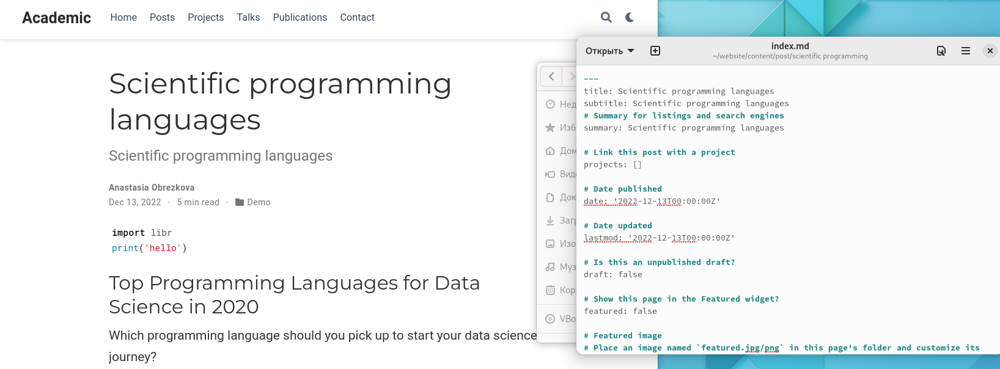

---
## Front matter
lang: ru-RU
title: Индивидуальный проект этап №5
subtitle: Дисциплина "Операционные системы"
author:
  - Обрезкова А.В.
institute:
  - Российский университет дружбы народов, Москва, Россия
  - ФФМиЕН
date: 13 мая 2023

## i18n babel
babel-lang: russian
babel-otherlangs: english

## Formatting pdf
toc: false
toc-title: Содержание
slide_level: 2
aspectratio: 169
section-titles: true
theme: metropolis
header-includes:
 - \metroset{progressbar=frametitle,sectionpage=progressbar,numbering=fraction}
 - '\makeatletter'
 - '\beamer@ignorenonframefalse'
 - '\makeatother'
---

# Информация

## Докладчик

:::::::::::::: {.columns align=center}
::: {.column width="70%"}

  * Обрезкова Анастасия Владимировна
  * студентка направления "Математика и механика"
  * Российский университет дружбы народов
  * [1132226505@pfur.ru](1132226505@mail.ru)

:::
::: {.column width="30%"}

:::
::::::::::::::

# Вводная часть

## Цель работы

- Добавить с сайту все остальные элементы.

## Задачи

- Сделать записи для персональных проектов.

- Сделать пост по прошедшей неделе.

- Добавить пост на тему по выбору.

# Основная часть

## 

- Сделала записи для персональных проектов.

## 

- Сделать пост по прошедшей неделе.

## 

- Добавить пост на тему по выбору: Языки научного программирования.

# Заключение

## Вывод

В результате реализации второго этапа индивидуального проекта я добавить с сайту все остальные элементы.

