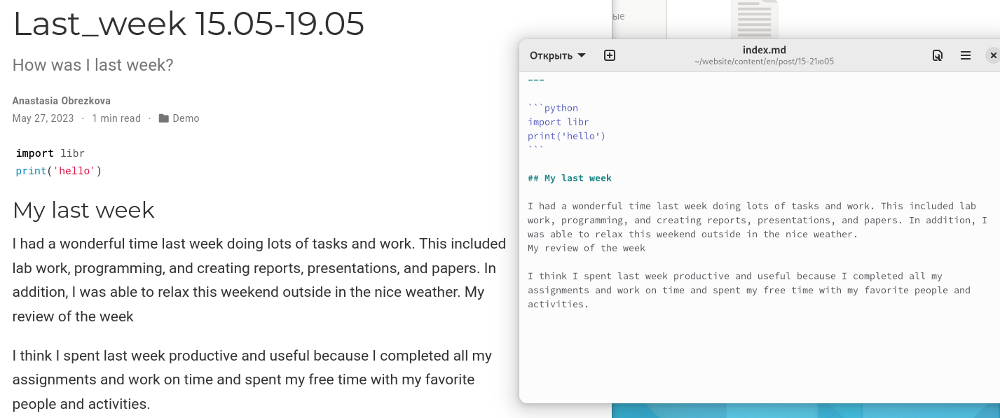
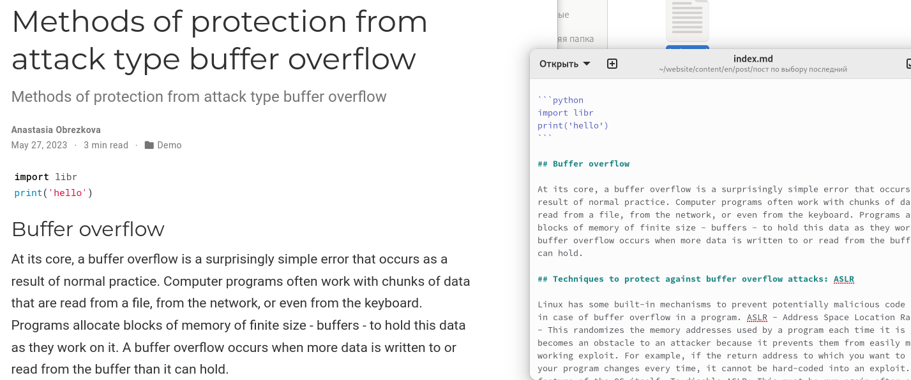

---
## Front matter
lang: ru-RU
title: Индивидуальный проект этап №6
subtitle: Дисциплина "Операционные системы"
author:
  - Обрезкова А.В.
institute:
  - Российский университет дружбы народов, Москва, Россия
  - ФФМиЕН
date: 27 мая 2023

## i18n babel
babel-lang: russian
babel-otherlangs: english

## Formatting pdf
toc: false
toc-title: Содержание
slide_level: 2
aspectratio: 169
section-titles: true
theme: metropolis
header-includes:
 - \metroset{progressbar=frametitle,sectionpage=progressbar,numbering=fraction}
 - '\makeatletter'
 - '\beamer@ignorenonframefalse'
 - '\makeatother'
---

# Информация

## Докладчик

:::::::::::::: {.columns align=center}
::: {.column width="70%"}

  * Обрезкова Анастасия Владимировна
  * студентка направления "Математика и механика"
  * Российский университет дружбы народов
  * [1132226505@pfur.ru](1132226505@mail.ru)

:::
::: {.column width="30%"}

:::
::::::::::::::

# Вводная часть

## Цель работы

- РЗакончить оформление сайта, приобрести новые навыки по созданию сайта, сделать поддержку двух языков.

## Задачи

- Сделать поддержку английского и русского языков.
   
- Разместить элементы сайта на обоих языках.

- Разместить контент на обоих языках.
   
- Сделать пост по прошедшей неделе.
   
- Добавить пост на тему по выбору (на двух языках).

# Основная часть

## 

- Я действовала по алгоритму, который есть на сайте [https://wowchemy.com/docs/getting-started/page-builder/#icons]. Сначала создала папку i18n и создала там два файл ru.yaml и en.ymal. Затем, разместила там скрипты для русского и английского языка.

## 

## 

## 

- Для удобства создаю в папке *content* две папки, в которых будут храниться все файлы на разных языках.

## 

- Затем в папке config -> _default -> languages добавляем русский язык. Проверяем изменения на сайте

## 

- Далее делаем перевод всех постов и информации. Вот примеры некоторых.

## 

## 

- Для перевода меню в папке config делаем новый документ с русским языком

## 

## 

- Сделаем пост недели и пост по теме. Также переведём их на другой язык.

## 

# Заключение

## Вывод

В процессе выполнения я приобрела практические навыки по созданию сайта, закончила создание сайта.

